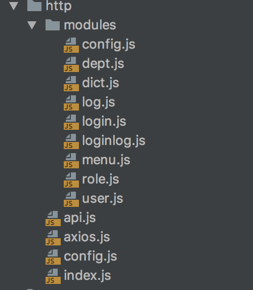

## 封装axios
### 封装目标
- 统一url配置
- 统一api请求
- 请求头设置header
- 处理响应
### 目录结构

### 全局配置global.js
```js
/**
 * 全局配置
 */
//后端地址
export const baseUrl='http://localhost:8081'
//数据备份恢复地址
export const backupBaseUrl='http://localhost:8082'

export default {
  baseUrl, backupBaseUrl
}
```
### 统一配置config.js
```js
import {baseUrl} from "../utils/global";

export default {
  method: 'get',
  baseUrl: baseUrl,
  headers:{
    'Content-Type':'application/json;charset=UTF-8'
  },
  data: {},
  timeout: 10000,
  withCredentials: true,
  responseType:'json'
}
```
### 处理请求响应axios.js
```js
import axios from 'axios'
import config from './config'
import Cookies from "js-cookie"
import router from '../router'

export default function $axios(options) {
  return new Promise((resolve,reject)=>{
    const instance=axios.create({
      baseURL:config.baseUrl,
      headers:config.headers,
      timeout:config.timeout,
      withCredentials:config.withCredentials
    })
    //请求拦截器
    instance.interceptors.request.use(
      config=>{
        let token=Cookies.get('token')
        if (token) {
          config.headers.token = token;
        } else {
          //重定向到登录页面
          router.push('/login')
        }
        return config
      },
      error => {
        return Promise.reject(error);
      }
    )
    //响应拦截器
    instance.interceptors.response.use(
      response=>{
        return response.data
      },
      error => {
        return Promise.reject(error)
      }
    )
    //请求处理
    instance(options).then(res=>{
      resolve(res)
      return false
    }).catch(error=>{
      reject(error);
    })
  })
}
```
### 插件开发,index.js
```js
import api from './api'

const install=Vue=>{
  if (install.installed)
    return;
  install.installed=true;
  Object.defineProperties(Vue.prototype,{
    //挂载到vue原型的$api对象上
    $api:{
      get() {
        return api
      }
    }
  })
}

export default install
```
### 插件使用
```js
//api
import api from './http'
Vue.use(api)
```
### 挂载全局属性
```js
import global from './utils/global'
Vue.prototype.$global = global;
```
### 聚合模块请求api.js
```js
import * as login from './modules/login'
import * as user from './modules/user'
import * as dept from './modules/dept'
import * as role from './modules/role'
import * as menu from './modules/menu'
import * as dict from './modules/dict'
import * as config from './modules/config'
import * as log from './modules/log'
import * as loginlog from './modules/loginlog'

export default {
  login,user,dept,role,menu,dict,config,log,loginlog
}
```
### 模块请求user.js
```js
import axios from '../axios'

let modouleUrl='/sys/user/'
export const save=(data)=>{
  return axios({
    url:modouleUrl,
    method: 'post',
    data
  })
}
export const find=(data)=>{
  return axios({
    url: modouleUrl,
    method: 'get',
    data
  })
}

export const batchDelete=(data)=>{
  return axios({
    url: modouleUrl,
    method: 'DELETE',
    data
  })
}

export const pages=(data)=>{
  return axios({
    url:modouleUrl+'pages',
    method: 'post',
    data
  })
}
```

