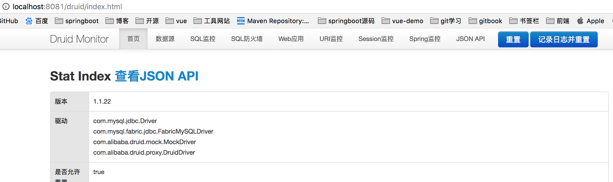

## 集成druid数据源
集成mybatis里面使用的是springboot提供的默认数据源是org.apache.tomcat.jdbc.pool.DataSource
druid是阿里巴巴提供的jdbc开源数据源,除此之外还提供数据库监控和扩展
### 添加依赖
```xml
<!--druid-->
        <dependency>
            <groupId>com.alibaba</groupId>
            <artifactId>druid-spring-boot-starter</artifactId>
            <version>1.1.13</version>
        </dependency>
```
### 添加配置
使用druid替换springboot提供的数据源配置
```yml
#spring:
#  datasource:
#    driver-class-name: com.mysql.jdbc.Driver
#    url: jdbc:mysql://localhost:3306/badger?useUnicode=true&characterEncoding=utf-8&serverTimezone=Asia/Shanghai
#    password: 123456
#    username: root

spring:
  datasource:
    type: com.alibaba.druid.pool.DruidDataSource
    druid:
      driver-class-name: com.mysql.jdbc.Driver
      url: jdbc:mysql://localhost:3306/badger?useUnicode=true&characterEncoding=utf-8&serverTimezone=Asia/Shanghai&useSSL=false
      username: root
      password: 123456
      filters: stat,wall,log4j2,config
      max-active: 100
      initial-size: 1
      max-wait: 60000
      min-idle: 1
      time-between-eviction-runs-millis: 60000
      min-evictable-idle-time-millis: 300000
      validation-query: select 'x'
      test-while-idle: true
      test-on-borrow: false
      test-on-return: false
      pool-prepared-statements: true
      max-open-prepared-statements: 50
      max-pool-prepared-statement-per-connection-size: 20
```
### ssl警告
WARN: Establishing SSL connection without server's identity verification is not recommended. According to MySQL 5.5.45+, 5.6.26+ and 5.7.6+ requirements SSL connection must be established by default if explicit option isn't set. For compliance with existing applications not using SSL the verifyServerCertificate property is set to 'false'. You need either to explicitly disable SSL by setting useSSL=false, or set useSSL=true and provide truststore for server certificate verification.
MySQL在高版本需要指明是否进行SSL(保障Internet数据传输安全利用数据加密)
解决:在druid数据源里配置
```
url: jdbc:mysql://localhost:3306/badger?useUnicode=true&characterEncoding=utf-8&serverTimezone=Asia/Shanghai&useSSL=false
```
### 配置log4j2
druid配置里需要log4j2,先要把springboot里面的logback去除掉
```xml
<dependency>
            <groupId>org.springframework.boot</groupId>
            <artifactId>spring-boot-starter-web</artifactId>
            <exclusions>
                <exclusion>
                    <groupId>org.springframework.boot</groupId>
                    <artifactId>spring-boot-starter-logging</artifactId>
                </exclusion>
            </exclusions>
</dependency>
<dependency>
            <groupId>org.springframework.boot</groupId>
            <artifactId>spring-boot-starter-log4j2</artifactId>
</dependency>
```
### log4j2配置
application.yml同名下默认log4j2-spring.xml,如果自定义文件名需要在application.yml中进行配置
```yml
#日志配置
logging:
  config: log4j2.xml
  level:
    org.yanse.badger: trace
```
log4j2-spring.xml
```xml
<?xml version="1.0" encoding="UTF-8"?>
<configuration status="WARN">
    <appenders>
        <!--  输出控制台的配置 -->
        <Console name="console" target="SYSTEM_OUT">
            <!--  控制台只输出level及以上级别的信息（onMatch），其他的直接拒绝（onMismatch） -->
            <ThresholdFilter level="trace" onMatch="ACCEPT" onMismatch="DENY"/>
            <!--  这个都知道是输出日志的格式 -->
            <PatternLayout pattern="%d{HH:mm:ss.SSS} %-5level %class{36} %L %M - %msg%xEx%n"/>
        </Console>

        <!--配置自定义日志，按天输出-->
        <RollingFile name="weather" fileName="/log/day.log" filePattern="/log/weather-%d{yyyy-MM-dd}.log" >
            <PatternLayout pattern="%d{yyyy.MM.dd HH:mm:ss.SSS} %-5level %class{36} %L %M - %msg%xEx%n"/>
            <Policies>
                <TimeBasedTriggeringPolicy />
            </Policies>
        </RollingFile>

        <!-- 把系统所有的error全部打到这个文件里  -->
        <File name="error" fileName="/log/error.log">
            <ThresholdFilter level="error" onMatch="ACCEPT" onMismatch="DENY"/>
            <PatternLayout pattern="%d{yyyy.MM.dd HH:mm:ss z} %-5level %class{36} %L %M - %msg%xEx%n"/>
        </File>

    </appenders>

    <!-- 然后定义logger，只有定义了logger并引入的appender，appender才会生效 -->
    <loggers>
        <!--过滤掉spring和mybatis的一些无用的DEBUG信息-->
        <logger name="org.springframework" level="ERROR"></logger>
        <logger name="org.mybatis" level="ERROR"></logger>
        <logger name="org.hibernate" level="ERROR"></logger>

        <root level="info">
            <appender-ref ref="console"/>
            <appender-ref ref="error" />
        </root>

        <!-- additivity="true" 的意思是会在控制台也输入一份-->
        <logger name="weather" level="info" additivity="true">
            <appender-ref ref="weather"/>
        </logger>

    </loggers>
</configuration>
```
另一个配置文件,这个较好用
```xml
<?xml version="1.0" encoding="UTF-8"?>
<!--Configuration后面的status，这个用于设置log4j2自身内部的信息输出，可以不设置，当设置成trace时，你会看到log4j2内部各种详细输出-->
<!--monitorInterval：Log4j能够自动检测修改配置 文件和重新配置本身，设置间隔秒数-->
<configuration monitorInterval="5">
    <!--日志级别以及优先级排序: OFF > FATAL > ERROR > WARN > INFO > DEBUG > TRACE > ALL -->

    <!--变量配置-->
    <Properties>
        <!-- 格式化输出：%date表示日期，%thread表示线程名，%-5level：级别从左显示5个字符宽度 %msg：日志消息，%n是换行符-->
        <!-- %logger{36} 表示 Logger 名字最长36个字符 -->
        <property name="LOG_PATTERN" value="%date{HH:mm:ss.SSS} [%thread] %-5level %logger{36} - %msg%n" />
        <!-- 定义日志存储的路径 -->
        <property name="FILE_PATH" value="./log" />
        <property name="FILE_NAME" value="badger" />
    </Properties>

    <appenders>

        <console name="Console" target="SYSTEM_OUT">
            <!--输出日志的格式-->
            <PatternLayout pattern="${LOG_PATTERN}"/>
            <!--控制台只输出level及其以上级别的信息（onMatch），其他的直接拒绝（onMismatch）-->
            <ThresholdFilter level="info" onMatch="ACCEPT" onMismatch="DENY"/>
        </console>

        <!--文件会打印出所有信息，这个log每次运行程序会自动清空，由append属性决定，适合临时测试用-->
        <File name="Filelog" fileName="${FILE_PATH}/test.log" append="false">
            <PatternLayout pattern="${LOG_PATTERN}"/>
        </File>

        <!-- 这个会打印出所有的info及以下级别的信息，每次大小超过size，则这size大小的日志会自动存入按年份-月份建立的文件夹下面并进行压缩，作为存档-->
        <RollingFile name="RollingFileInfo" fileName="${FILE_PATH}/info.log" filePattern="${FILE_PATH}/${FILE_NAME}-INFO-%d{yyyy-MM-dd}_%i.log.gz">
            <!--控制台只输出level及以上级别的信息（onMatch），其他的直接拒绝（onMismatch）-->
            <ThresholdFilter level="info" onMatch="ACCEPT" onMismatch="DENY"/>
            <PatternLayout pattern="${LOG_PATTERN}"/>
            <Policies>
                <!--interval属性用来指定多久滚动一次，默认是1 hour-->
                <TimeBasedTriggeringPolicy interval="1"/>
                <SizeBasedTriggeringPolicy size="10MB"/>
            </Policies>
            <!-- DefaultRolloverStrategy属性如不设置，则默认为最多同一文件夹下7个文件开始覆盖-->
            <DefaultRolloverStrategy max="15"/>
        </RollingFile>

        <!-- 这个会打印出所有的warn及以下级别的信息，每次大小超过size，则这size大小的日志会自动存入按年份-月份建立的文件夹下面并进行压缩，作为存档-->
        <RollingFile name="RollingFileWarn" fileName="${FILE_PATH}/warn.log" filePattern="${FILE_PATH}/${FILE_NAME}-WARN-%d{yyyy-MM-dd}_%i.log.gz">
            <!--控制台只输出level及以上级别的信息（onMatch），其他的直接拒绝（onMismatch）-->
            <ThresholdFilter level="warn" onMatch="ACCEPT" onMismatch="DENY"/>
            <PatternLayout pattern="${LOG_PATTERN}"/>
            <Policies>
                <!--interval属性用来指定多久滚动一次，默认是1 hour-->
                <TimeBasedTriggeringPolicy interval="1"/>
                <SizeBasedTriggeringPolicy size="10MB"/>
            </Policies>
            <!-- DefaultRolloverStrategy属性如不设置，则默认为最多同一文件夹下7个文件开始覆盖-->
            <DefaultRolloverStrategy max="15"/>
        </RollingFile>

        <!-- 这个会打印出所有的error及以下级别的信息，每次大小超过size，则这size大小的日志会自动存入按年份-月份建立的文件夹下面并进行压缩，作为存档-->
        <RollingFile name="RollingFileError" fileName="${FILE_PATH}/error.log" filePattern="${FILE_PATH}/${FILE_NAME}-ERROR-%d{yyyy-MM-dd}_%i.log.gz">
            <!--控制台只输出level及以上级别的信息（onMatch），其他的直接拒绝（onMismatch）-->
            <ThresholdFilter level="error" onMatch="ACCEPT" onMismatch="DENY"/>
            <PatternLayout pattern="${LOG_PATTERN}"/>
            <Policies>
                <!--interval属性用来指定多久滚动一次，默认是1 hour-->
                <TimeBasedTriggeringPolicy interval="1"/>
                <SizeBasedTriggeringPolicy size="10MB"/>
            </Policies>
            <!-- DefaultRolloverStrategy属性如不设置，则默认为最多同一文件夹下7个文件开始覆盖-->
            <DefaultRolloverStrategy max="15"/>
        </RollingFile>

    </appenders>

    <!--Logger节点用来单独指定日志的形式，比如要为指定包下的class指定不同的日志级别等。-->
    <!--然后定义loggers，只有定义了logger并引入的appender，appender才会生效-->
    <loggers>

        <!--过滤掉spring和mybatis的一些无用的DEBUG信息-->
        <logger name="org.mybatis" level="info" additivity="false">
            <AppenderRef ref="Console"/>
        </logger>
        <!--监控系统信息-->
        <!--若是additivity设为false，则 子Logger 只会在自己的appender里输出，而不会在 父Logger 的appender里输出。-->
        <Logger name="org.springframework" level="info" additivity="false">
            <AppenderRef ref="Console"/>
        </Logger>

        <root level="info">
            <appender-ref ref="Console"/>
            <appender-ref ref="Filelog"/>
            <appender-ref ref="RollingFileInfo"/>
            <appender-ref ref="RollingFileWarn"/>
            <appender-ref ref="RollingFileError"/>
        </root>
    </loggers>

</configuration>
```
### 自定义Druid配置
config/DruidDataSourceProperties
```java
//自定义properties
@ConfigurationProperties(prefix = "spring.datasource.druid")
public class DruidDataSourceProperties {
    private String driverClassName;
    private String url;
    private String username;
    private String password;

    private int initialSize;
    private int minIdle;
    private int maxActive = 100;
    private long maxWait;
    private long timeBetweenEvictionRunsMillis;
    private long minEvictableIdleTimeMillis;
    private String validationQuery;
    private boolean testWhileIdle;
    private boolean testOnBorrow;
    private boolean testOnReturn;
    private boolean poolPreparedStatements;
    private int maxPoolPreparedStatementPerConnectionSize;
    private String filters;
    //省略setter&getter
```
config/DruidConfig
```java
@Configuration
@EnableConfigurationProperties({DruidDataSourceProperties.class})
public class DruidConfig {
    @Autowired
    private DruidDataSourceProperties properties;

    @Bean
    @ConditionalOnMissingBean
    public DataSource druidDataSource() {
        DruidDataSource druidDataSource = new DruidDataSource();
        druidDataSource.setDriverClassName(properties.getDriverClassName());
        druidDataSource.setUrl(properties.getUrl());
        druidDataSource.setUsername(properties.getUsername());
        druidDataSource.setPassword(properties.getPassword());
        druidDataSource.setInitialSize(properties.getInitialSize());
        druidDataSource.setMinIdle(properties.getMinIdle());
        druidDataSource.setMaxActive(properties.getMaxActive());
        druidDataSource.setMaxWait(properties.getMaxWait());
        druidDataSource.setTimeBetweenEvictionRunsMillis(properties.getTimeBetweenEvictionRunsMillis());
        druidDataSource.setMinEvictableIdleTimeMillis(properties.getMinEvictableIdleTimeMillis());
        druidDataSource.setValidationQuery(properties.getValidationQuery());
        druidDataSource.setTestWhileIdle(properties.isTestWhileIdle());
        druidDataSource.setTestOnBorrow(properties.isTestOnBorrow());
        druidDataSource.setTestOnReturn(properties.isTestOnReturn());
        druidDataSource.setPoolPreparedStatements(properties.isPoolPreparedStatements());
        druidDataSource.setMaxPoolPreparedStatementPerConnectionSize(properties.getMaxPoolPreparedStatementPerConnectionSize());

        try {
            druidDataSource.setFilters(properties.getFilters());
            druidDataSource.init();
        } catch (SQLException e) {
            e.printStackTrace();
        }

        return druidDataSource;
    }
    /**
     * 注册Servlet信息， 配置监控视图
     *
     * @return
     */
    @Bean
    @ConditionalOnMissingBean
    public ServletRegistrationBean druidServlet() {
        ServletRegistrationBean servletRegistrationBean = new ServletRegistrationBean(new StatViewServlet(), "/druid/*");

        //白名单：
        servletRegistrationBean.addInitParameter("allow","192.168.6.195");
        //IP黑名单 (存在共同时，deny优先于allow) : 如果满足deny的话提示:Sorry, you are not permitted to view this page.
        servletRegistrationBean.addInitParameter("deny","192.168.6.73");
        //登录查看信息的账号密码, 用于登录Druid监控后台
        servletRegistrationBean.addInitParameter("loginUsername", "admin");
        servletRegistrationBean.addInitParameter("loginPassword", "admin");
        //是否能够重置数据.
        servletRegistrationBean.addInitParameter("resetEnable", "true");
        return servletRegistrationBean;
    }
    /**
     * 注册Filter信息, 监控拦截器
     *
     * @return
     */
    @Bean
    @ConditionalOnMissingBean
    public FilterRegistrationBean filterRegistrationBean() {
        FilterRegistrationBean filterRegistrationBean = new FilterRegistrationBean();
        filterRegistrationBean.setFilter(new WebStatFilter());
        filterRegistrationBean.addUrlPatterns("/*");
        filterRegistrationBean.addInitParameter("exclusions", "*.js,*.gif,*.jpg,*.png,*.css,*.ico,/druid/*");
        return filterRegistrationBean;
    }
}
```
### 测试验证
浏览器打开
通过控制器接口测试druid数据源

