## 安装开发环境
1. jdk:1.8.0_131
2. 开发工具: idea
3. 数据库:MySQL5.7
4. 依赖工具:maven3.6.0
### 创建项目
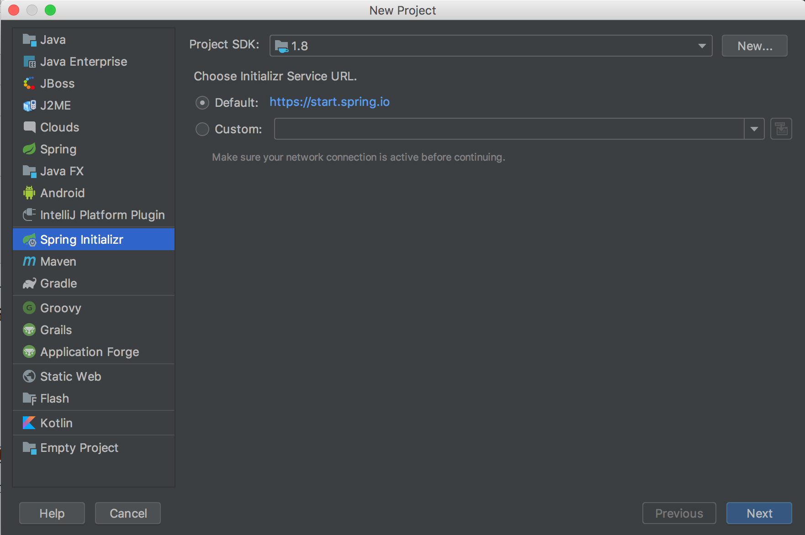
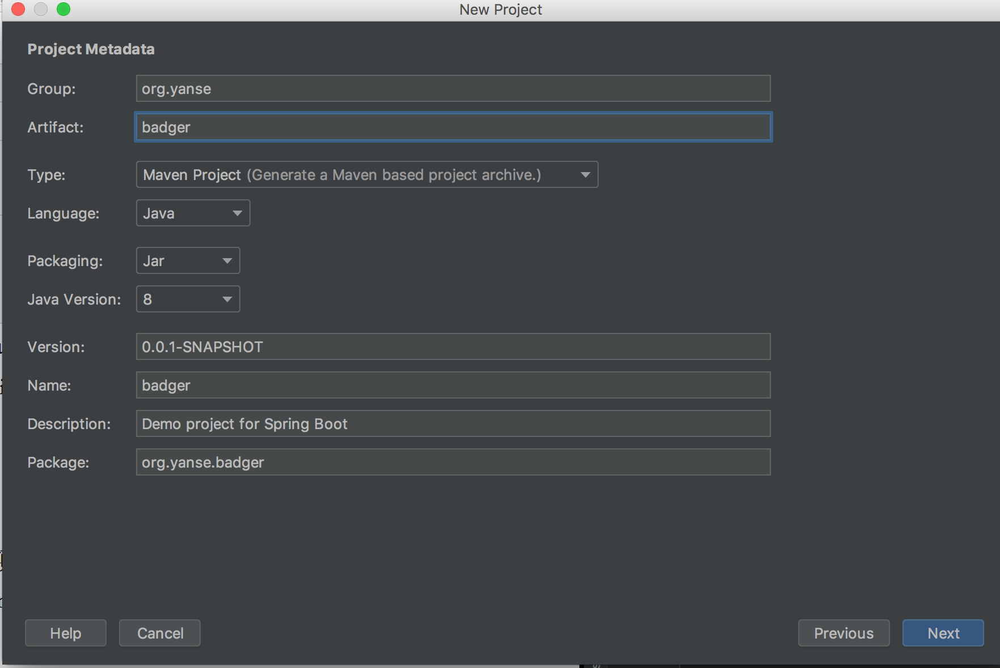
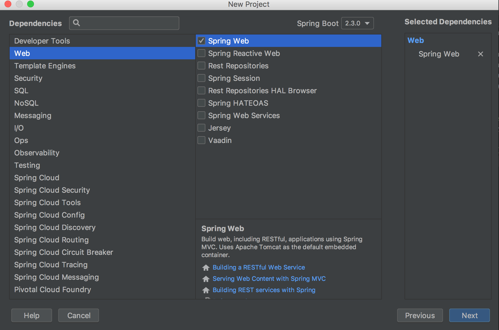
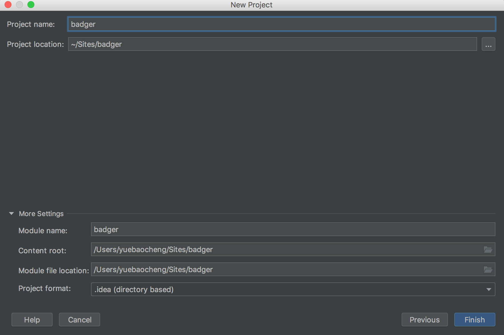
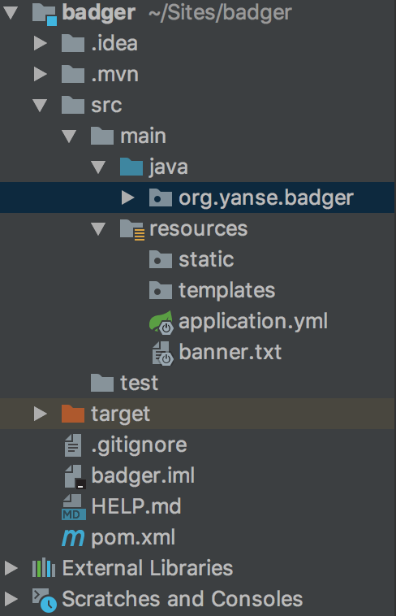
### 项目测试
1. application.yml修改端口
```
server:
  port: 8081
```
2. org.yanse.badger包下创建controller/HelloController
```java
@RestController
public class HelloController {
    @GetMapping("/hello")
    public String hello() {
        return "hello";
    }
}
```
3. 运行项目测试


## 集成swagger2
Swagger2 的出现就是为了从根本上解决上述问题。它作为一个规范和完整的框架，可以用于生成、描述、调用和可视化 RESTful 风格的 Web 服务：
- 接口文档在线自动生成，文档随接口变动实时更新，节省维护成本
- 支持在线接口测试，不依赖第三方工具
### 添加依赖
```xml
<dependencies>
    <dependency>
        <groupId>io.springfox</groupId>
        <artifactId>springfox-swagger-ui</artifactId>
        <version>2.9.2</version>
    </dependency>
    <dependency>
       <groupId>io.springfox</groupId>
       <artifactId>springfox-swagger2</artifactId>
       <version>2.9.2</version>
    </dependency>
</dependencies>
```
### 配置Swagger2
org.yanse.badger下创建config/SwaggerConfig,
```java
@Configuration
@EnableSwagger2
public class SwaggerConfig {
    public static final String VERSION = "1.0.0";
    @Bean
    public Docket createRestApi() {
        return new Docket(DocumentationType.SWAGGER_2).apiInfo(apiInfo())
                .select()
                .apis(RequestHandlerSelectors.any())
                .paths(PathSelectors.any())
                .build();
    }

    private ApiInfo apiInfo() {
        return new ApiInfoBuilder()
                .title("badger接口文档") //设置文档的标题
                .description("badger接口文档") // 设置文档的描述
                .version(VERSION) // 设置文档的版本信息-> 1.0.0 Version information
                .build();
    }
}
```
### 页面测试
浏览器打开http://localhost:8081/swagger-ui.html#/
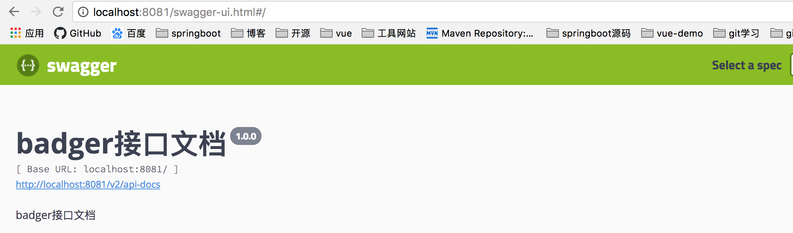
点击try it out
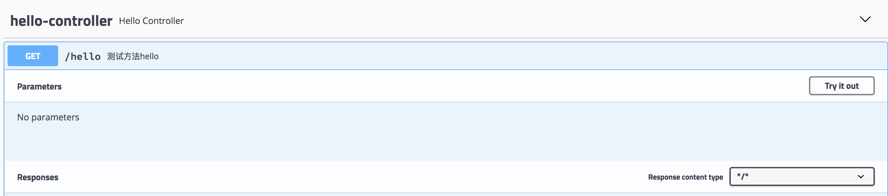
点击excute
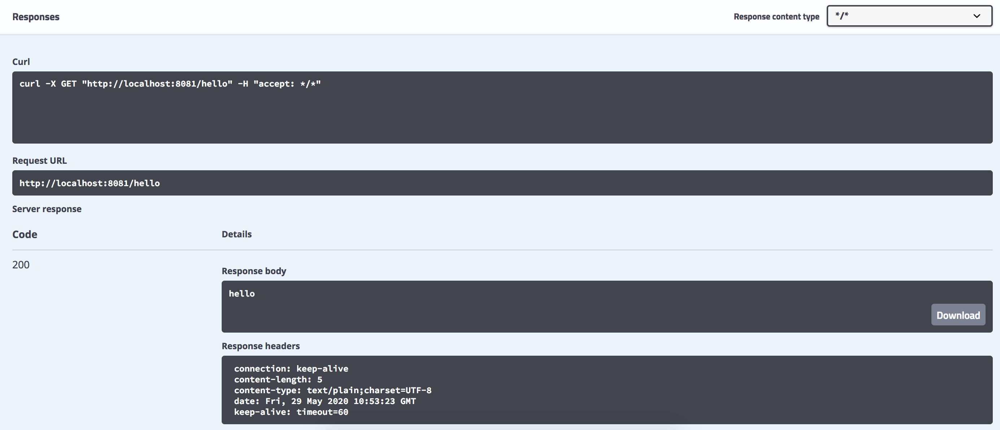

## 集成mybatis
通过maven插件 mybatis generator,自动生成model,dao,mapper xml
### 插件生成代码
pom.xml中引入插件
```xml
<plugin>
                <groupId>org.mybatis.generator</groupId>
                <artifactId>mybatis-generator-maven-plugin</artifactId>
                <version>1.4.0</version>
                <configuration>
                    <configurationFile>src/main/resources/mybatis-generator/generatorConfig.xml</configurationFile>
                    <verbose>true</verbose>
                    <overwrite>true</overwrite>
                </configuration>
                <executions>
                    <execution>
                        <id>Generate MyBatis Artifacts</id>
                        <goals>
                            <goal>generate</goal>
                        </goals>
                    </execution>
                </executions>
                <dependencies>
                    <dependency>
                        <groupId>org.mybatis.generator</groupId>
                        <artifactId>mybatis-generator-core</artifactId>
                        <version>1.3.7</version>
                    </dependency>
                    <dependency>
                        <groupId>mysql</groupId>
                        <artifactId>mysql-connector-java</artifactId>
                        <version>5.1.47</version>
                    </dependency>
                </dependencies>
            </plugin>
```
resources下创建mybatis-generator/generatorConfig.xml,配置generatorConfig.xml
```xml
<?xml version="1.0" encoding="UTF-8"?>
<!DOCTYPE generatorConfiguration
        PUBLIC "-//mybatis.org//DTD MyBatis Generator Configuration 1.0//EN"
        "http://mybatis.org/dtd/mybatis-generator-config_1_0.dtd">

<generatorConfiguration>
    <properties resource="mybatis-generator/generator.properties"/>
    <context id="MySqlContext" targetRuntime="MyBatis3Simple" defaultModelType="flat">
        <property name="beginningDelimiter" value="`"/>
        <property name="endingDelimiter" value="`"/>
        <property name="javaFileEncoding" value="UTF-8"/>
        <!-- 为模型生成序列化方法-->
        <plugin type="org.mybatis.generator.plugins.SerializablePlugin"/>
        <!-- 为生成的Java模型创建一个toString方法 -->
        <plugin type="org.mybatis.generator.plugins.ToStringPlugin"/>
        <!--生成mapper.xml时覆盖原文件-->
        <plugin type="org.mybatis.generator.plugins.UnmergeableXmlMappersPlugin" />
        <commentGenerator >
            <!-- 是否去除自动生成的注释 true：是 ： false:否 -->
            <property name="suppressAllComments" value="true"/>
            <property name="suppressDate" value="true"/>
            <property name="addRemarkComments" value="true"/>
        </commentGenerator>

        <jdbcConnection driverClass="${jdbc.driverClass}"
                        connectionURL="${jdbc.connectionURL}"
                        userId="${jdbc.userId}"
                        password="${jdbc.password}">
            <!--解决mysql驱动升级到8.0后不生成指定数据库代码的问题-->
            <property name="nullCatalogMeansCurrent" value="true" />
        </jdbcConnection>

        <javaModelGenerator targetPackage="org.yanse.badger.model" targetProject="/Users/yuebaocheng/Sites/badger/src/main/java"/>

        <sqlMapGenerator targetPackage="org.yanse.badger.sqlmapper" targetProject="/Users/yuebaocheng/Sites/badger/src/main/java"/>

        <javaClientGenerator type="XMLMAPPER" targetPackage="org.yanse.badger.dao"
                             targetProject="/Users/yuebaocheng/Sites/badger/src/main/java"/>
        <!--生成全部表tableName设为%-->
        <table tableName="%">
            <generatedKey column="id" sqlStatement="MySql" identity="true"/>
        </table>
    </context>
</generatorConfiguration>
```
resources/mybatis-generator下创建generator.properties
```
jdbc.driverClass=com.mysql.jdbc.Driver
jdbc.connectionURL=jdbc:mysql://localhost:3306/badger?useUnicode=true&characterEncoding=utf-8&serverTimezone=Asia/Shanghai
jdbc.userId=root
jdbc.password=123456
```
org.yanse.badger下创建model,dao,sqlmapper
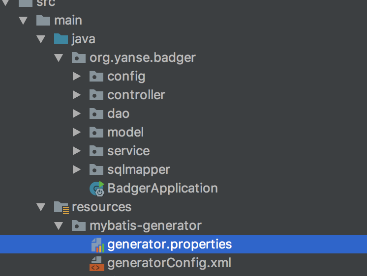
maven plugin执行生成代码
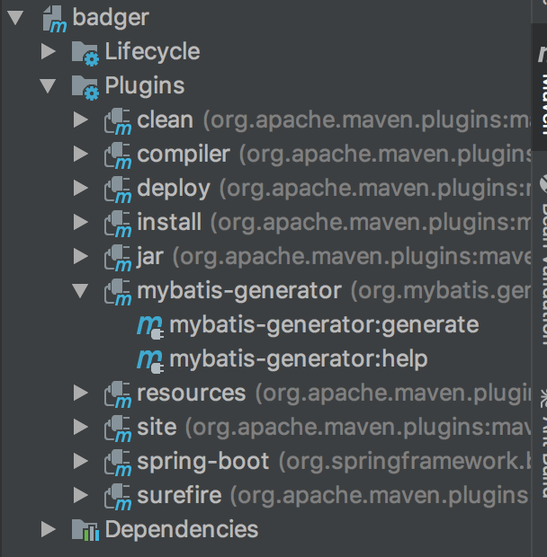
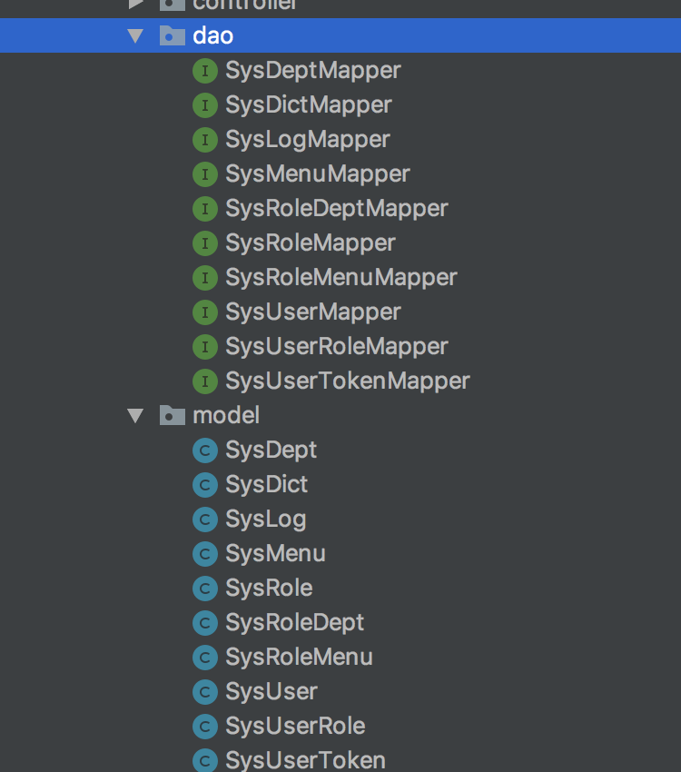
### 引入依赖
```xml
        <dependency>
            <groupId>org.mybatis.spring.boot</groupId>
            <artifactId>mybatis-spring-boot-starter</artifactId>
            <version>1.3.2</version>
        </dependency>
        <dependency>
            <groupId>mysql</groupId>
            <artifactId>mysql-connector-java</artifactId>
            <version>5.1.47</version>
        </dependency>
```
### 添加配置
config/MybatisConfig.java
@MapperScan("org.yanse.badger.**.dao")扫描mapper接口
```java
@Configuration
@MapperScan("org.yanse.badger.**.dao")
public class MybatisConfig {
    @Autowired
    private DataSource dataSource;

    @Bean
    public SqlSessionFactory sqlSessionFactory() throws Exception {
        SqlSessionFactoryBean sqlSessionFactoryBean = new SqlSessionFactoryBean();
        sqlSessionFactoryBean.setDataSource(dataSource);
        sqlSessionFactoryBean.setTypeAliasesPackage("org.yanse.badger.**.model");

        PathMatchingResourcePatternResolver resolver = new PathMatchingResourcePatternResolver();
        sqlSessionFactoryBean.setMapperLocations(resolver.getResources("classpath*:**/sqlmapper/*.xml"));
        return sqlSessionFactoryBean.getObject();
    }
}
```
### 添加数据源配置
```yml
spring:
  datasource:
    driver-class-name: com.mysql.jdbc.Driver
    url: jdbc:mysql://localhost:3306/badger?useUnicode=true&characterEncoding=utf-8&serverTimezone=Asia/Shanghai
    password: 123456
    username: root
```
### 配置打包资源
pom.xml中配置resources,打包时引入sql映射文件,不然报错
```xml
<resources>
            <resource>
                <directory>src/main/java</directory>
                <includes>
                    <include>**/sqlmapper/*.xml</include>
                </includes>
            </resource>
            <resource>
                <directory>src/main/resources</directory>
            </resource>
</resources>
```
### 编写测试api
controller/SysUserController.java
```java
@RestController
@RequestMapping("/user")
public class SysUserController {
    @Autowired
    private SysUserService sysUserService;

    @GetMapping("/findAll")
    public List<SysUser> findAll() {
        return sysUserService.findAll();
    }

}
```

## 集成druid数据源
集成mybatis里面使用的是springboot提供的默认数据源是org.apache.tomcat.jdbc.pool.DataSource
druid是阿里巴巴提供的jdbc开源数据源,除此之外还提供数据库监控和扩展
### 添加依赖
```xml
<!--druid-->
        <dependency>
            <groupId>com.alibaba</groupId>
            <artifactId>druid-spring-boot-starter</artifactId>
            <version>1.1.13</version>
        </dependency>
```
### 添加配置
使用druid替换springboot提供的数据源配置
```yml
#spring:
#  datasource:
#    driver-class-name: com.mysql.jdbc.Driver
#    url: jdbc:mysql://localhost:3306/badger?useUnicode=true&characterEncoding=utf-8&serverTimezone=Asia/Shanghai
#    password: 123456
#    username: root

spring:
  datasource:
    type: com.alibaba.druid.pool.DruidDataSource
    druid:
      driver-class-name: com.mysql.jdbc.Driver
      url: jdbc:mysql://localhost:3306/badger?useUnicode=true&characterEncoding=utf-8&serverTimezone=Asia/Shanghai&useSSL=false
      username: root
      password: 123456
      filters: stat,wall,log4j2,config
      max-active: 100
      initial-size: 1
      max-wait: 60000
      min-idle: 1
      time-between-eviction-runs-millis: 60000
      min-evictable-idle-time-millis: 300000
      validation-query: select 'x'
      test-while-idle: true
      test-on-borrow: false
      test-on-return: false
      pool-prepared-statements: true
      max-open-prepared-statements: 50
      max-pool-prepared-statement-per-connection-size: 20
```
### ssl警告
WARN: Establishing SSL connection without server's identity verification is not recommended. According to MySQL 5.5.45+, 5.6.26+ and 5.7.6+ requirements SSL connection must be established by default if explicit option isn't set. For compliance with existing applications not using SSL the verifyServerCertificate property is set to 'false'. You need either to explicitly disable SSL by setting useSSL=false, or set useSSL=true and provide truststore for server certificate verification.
MySQL在高版本需要指明是否进行SSL(保障Internet数据传输安全利用数据加密)
解决:在druid数据源里配置
```
url: jdbc:mysql://localhost:3306/badger?useUnicode=true&characterEncoding=utf-8&serverTimezone=Asia/Shanghai&useSSL=false
```
### 配置log4j2
druid配置里需要log4j2,先要把springboot里面的logback去除掉
```xml
<dependency>
            <groupId>org.springframework.boot</groupId>
            <artifactId>spring-boot-starter-web</artifactId>
            <exclusions>
                <exclusion>
                    <groupId>org.springframework.boot</groupId>
                    <artifactId>spring-boot-starter-logging</artifactId>
                </exclusion>
            </exclusions>
</dependency>
<dependency>
            <groupId>org.springframework.boot</groupId>
            <artifactId>spring-boot-starter-log4j2</artifactId>
</dependency>
```
### log4j2配置
application.yml同名下默认log4j2-spring.xml,如果自定义需要在application.yml中进行配置
```yml
#日志配置
logging:
  config: log4j2.xml
  level:
    org.yanse.badger: trace
```
log4j2-spring.xml
```xml
<?xml version="1.0" encoding="UTF-8"?>
<configuration status="WARN">
    <appenders>
        <!--  输出控制台的配置 -->
        <Console name="console" target="SYSTEM_OUT">
            <!--  控制台只输出level及以上级别的信息（onMatch），其他的直接拒绝（onMismatch） -->
            <ThresholdFilter level="trace" onMatch="ACCEPT" onMismatch="DENY"/>
            <!--  这个都知道是输出日志的格式 -->
            <PatternLayout pattern="%d{HH:mm:ss.SSS} %-5level %class{36} %L %M - %msg%xEx%n"/>
        </Console>

        <!--配置自定义日志，按天输出-->
        <RollingFile name="weather" fileName="/log/day.log" filePattern="/log/weather-%d{yyyy-MM-dd}.log" >
            <PatternLayout pattern="%d{yyyy.MM.dd HH:mm:ss.SSS} %-5level %class{36} %L %M - %msg%xEx%n"/>
            <Policies>
                <TimeBasedTriggeringPolicy />
            </Policies>
        </RollingFile>

        <!-- 把系统所有的error全部打到这个文件里  -->
        <File name="error" fileName="/log/error.log">
            <ThresholdFilter level="error" onMatch="ACCEPT" onMismatch="DENY"/>
            <PatternLayout pattern="%d{yyyy.MM.dd HH:mm:ss z} %-5level %class{36} %L %M - %msg%xEx%n"/>
        </File>

    </appenders>

    <!-- 然后定义logger，只有定义了logger并引入的appender，appender才会生效 -->
    <loggers>
        <!--过滤掉spring和mybatis的一些无用的DEBUG信息-->
        <logger name="org.springframework" level="ERROR"></logger>
        <logger name="org.mybatis" level="ERROR"></logger>
        <logger name="org.hibernate" level="ERROR"></logger>

        <root level="info">
            <appender-ref ref="console"/>
            <appender-ref ref="error" />
        </root>

        <!-- additivity="true" 的意思是会在控制台也输入一份-->
        <logger name="weather" level="info" additivity="true">
            <appender-ref ref="weather"/>
        </logger>

    </loggers>
</configuration>
```
```xml
<?xml version="1.0" encoding="UTF-8"?>
<!--Configuration后面的status，这个用于设置log4j2自身内部的信息输出，可以不设置，当设置成trace时，你会看到log4j2内部各种详细输出-->
<!--monitorInterval：Log4j能够自动检测修改配置 文件和重新配置本身，设置间隔秒数-->
<configuration monitorInterval="5">
    <!--日志级别以及优先级排序: OFF > FATAL > ERROR > WARN > INFO > DEBUG > TRACE > ALL -->

    <!--变量配置-->
    <Properties>
        <!-- 格式化输出：%date表示日期，%thread表示线程名，%-5level：级别从左显示5个字符宽度 %msg：日志消息，%n是换行符-->
        <!-- %logger{36} 表示 Logger 名字最长36个字符 -->
        <property name="LOG_PATTERN" value="%date{HH:mm:ss.SSS} [%thread] %-5level %logger{36} - %msg%n" />
        <!-- 定义日志存储的路径 -->
        <property name="FILE_PATH" value="./log" />
        <property name="FILE_NAME" value="badger" />
    </Properties>

    <appenders>

        <console name="Console" target="SYSTEM_OUT">
            <!--输出日志的格式-->
            <PatternLayout pattern="${LOG_PATTERN}"/>
            <!--控制台只输出level及其以上级别的信息（onMatch），其他的直接拒绝（onMismatch）-->
            <ThresholdFilter level="info" onMatch="ACCEPT" onMismatch="DENY"/>
        </console>

        <!--文件会打印出所有信息，这个log每次运行程序会自动清空，由append属性决定，适合临时测试用-->
        <File name="Filelog" fileName="${FILE_PATH}/test.log" append="false">
            <PatternLayout pattern="${LOG_PATTERN}"/>
        </File>

        <!-- 这个会打印出所有的info及以下级别的信息，每次大小超过size，则这size大小的日志会自动存入按年份-月份建立的文件夹下面并进行压缩，作为存档-->
        <RollingFile name="RollingFileInfo" fileName="${FILE_PATH}/info.log" filePattern="${FILE_PATH}/${FILE_NAME}-INFO-%d{yyyy-MM-dd}_%i.log.gz">
            <!--控制台只输出level及以上级别的信息（onMatch），其他的直接拒绝（onMismatch）-->
            <ThresholdFilter level="info" onMatch="ACCEPT" onMismatch="DENY"/>
            <PatternLayout pattern="${LOG_PATTERN}"/>
            <Policies>
                <!--interval属性用来指定多久滚动一次，默认是1 hour-->
                <TimeBasedTriggeringPolicy interval="1"/>
                <SizeBasedTriggeringPolicy size="10MB"/>
            </Policies>
            <!-- DefaultRolloverStrategy属性如不设置，则默认为最多同一文件夹下7个文件开始覆盖-->
            <DefaultRolloverStrategy max="15"/>
        </RollingFile>

        <!-- 这个会打印出所有的warn及以下级别的信息，每次大小超过size，则这size大小的日志会自动存入按年份-月份建立的文件夹下面并进行压缩，作为存档-->
        <RollingFile name="RollingFileWarn" fileName="${FILE_PATH}/warn.log" filePattern="${FILE_PATH}/${FILE_NAME}-WARN-%d{yyyy-MM-dd}_%i.log.gz">
            <!--控制台只输出level及以上级别的信息（onMatch），其他的直接拒绝（onMismatch）-->
            <ThresholdFilter level="warn" onMatch="ACCEPT" onMismatch="DENY"/>
            <PatternLayout pattern="${LOG_PATTERN}"/>
            <Policies>
                <!--interval属性用来指定多久滚动一次，默认是1 hour-->
                <TimeBasedTriggeringPolicy interval="1"/>
                <SizeBasedTriggeringPolicy size="10MB"/>
            </Policies>
            <!-- DefaultRolloverStrategy属性如不设置，则默认为最多同一文件夹下7个文件开始覆盖-->
            <DefaultRolloverStrategy max="15"/>
        </RollingFile>

        <!-- 这个会打印出所有的error及以下级别的信息，每次大小超过size，则这size大小的日志会自动存入按年份-月份建立的文件夹下面并进行压缩，作为存档-->
        <RollingFile name="RollingFileError" fileName="${FILE_PATH}/error.log" filePattern="${FILE_PATH}/${FILE_NAME}-ERROR-%d{yyyy-MM-dd}_%i.log.gz">
            <!--控制台只输出level及以上级别的信息（onMatch），其他的直接拒绝（onMismatch）-->
            <ThresholdFilter level="error" onMatch="ACCEPT" onMismatch="DENY"/>
            <PatternLayout pattern="${LOG_PATTERN}"/>
            <Policies>
                <!--interval属性用来指定多久滚动一次，默认是1 hour-->
                <TimeBasedTriggeringPolicy interval="1"/>
                <SizeBasedTriggeringPolicy size="10MB"/>
            </Policies>
            <!-- DefaultRolloverStrategy属性如不设置，则默认为最多同一文件夹下7个文件开始覆盖-->
            <DefaultRolloverStrategy max="15"/>
        </RollingFile>

    </appenders>

    <!--Logger节点用来单独指定日志的形式，比如要为指定包下的class指定不同的日志级别等。-->
    <!--然后定义loggers，只有定义了logger并引入的appender，appender才会生效-->
    <loggers>

        <!--过滤掉spring和mybatis的一些无用的DEBUG信息-->
        <logger name="org.mybatis" level="info" additivity="false">
            <AppenderRef ref="Console"/>
        </logger>
        <!--监控系统信息-->
        <!--若是additivity设为false，则 子Logger 只会在自己的appender里输出，而不会在 父Logger 的appender里输出。-->
        <Logger name="org.springframework" level="info" additivity="false">
            <AppenderRef ref="Console"/>
        </Logger>

        <root level="info">
            <appender-ref ref="Console"/>
            <appender-ref ref="Filelog"/>
            <appender-ref ref="RollingFileInfo"/>
            <appender-ref ref="RollingFileWarn"/>
            <appender-ref ref="RollingFileError"/>
        </root>
    </loggers>

</configuration>
```
### 测试验证
通过控制器接口测试druid数据源

## 跨域方案
基于浏览器的同源策略,非同源脚本不可访问其他源下的资源,想要访问就需要跨域,
w3c提出跨域解决方案即cors,后端服务器实现cors接口实现跨域访问
### cors实现
config下新建Cors配置类
```java
@Configuration
public class CorsConfig implements WebMvcConfigurer {

    @Override
    public void addCorsMappings(CorsRegistry registry) {

        registry.addMapping("/**")    //允许跨域访问的路径
                .allowedOrigins("*")  //允许访问的源地址
                .allowedMethods("POST", "GET", "PUT", "OPTIONS", "DELETE") //允许的方法
                .maxAge(168000) //预检间隔时间
                .allowCredentials(true);//是否发送cookie
    }
}
```


