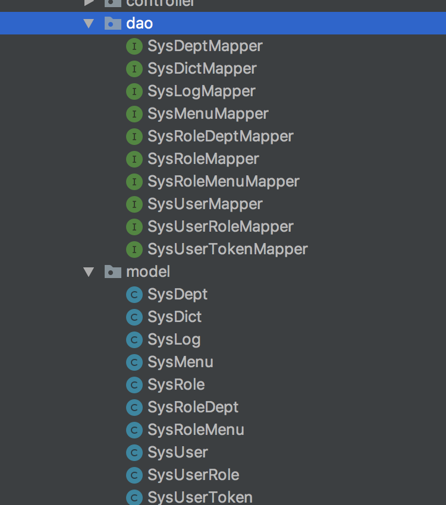

## 集成mybatis
通过maven插件 mybatis generator,自动生成model,dao,mapper xml
### 插件生成代码
pom.xml中引入插件
```xml
<plugin>
                <groupId>org.mybatis.generator</groupId>
                <artifactId>mybatis-generator-maven-plugin</artifactId>
                <version>1.4.0</version>
                <configuration>
                    <configurationFile>src/main/resources/mybatis-generator/generatorConfig.xml</configurationFile>
                    <verbose>true</verbose>
                    <overwrite>true</overwrite>
                </configuration>
                <executions>
                    <execution>
                        <id>Generate MyBatis Artifacts</id>
                        <goals>
                            <goal>generate</goal>
                        </goals>
                    </execution>
                </executions>
                <dependencies>
                    <dependency>
                        <groupId>org.mybatis.generator</groupId>
                        <artifactId>mybatis-generator-core</artifactId>
                        <version>1.3.7</version>
                    </dependency>
                    <dependency>
                        <groupId>mysql</groupId>
                        <artifactId>mysql-connector-java</artifactId>
                        <version>5.1.47</version>
                    </dependency>
                </dependencies>
            </plugin>
```
resources下创建mybatis-generator/generatorConfig.xml,配置generatorConfig.xml
```xml
<?xml version="1.0" encoding="UTF-8"?>
<!DOCTYPE generatorConfiguration
        PUBLIC "-//mybatis.org//DTD MyBatis Generator Configuration 1.0//EN"
        "http://mybatis.org/dtd/mybatis-generator-config_1_0.dtd">

<generatorConfiguration>
    <properties resource="mybatis-generator/generator.properties"/>
    <context id="MySqlContext" targetRuntime="MyBatis3Simple" defaultModelType="flat">
        <property name="beginningDelimiter" value="`"/>
        <property name="endingDelimiter" value="`"/>
        <property name="javaFileEncoding" value="UTF-8"/>
        <!-- 为模型生成序列化方法-->
        <plugin type="org.mybatis.generator.plugins.SerializablePlugin"/>
        <!-- 为生成的Java模型创建一个toString方法 -->
        <plugin type="org.mybatis.generator.plugins.ToStringPlugin"/>
        <!--生成mapper.xml时覆盖原文件-->
        <plugin type="org.mybatis.generator.plugins.UnmergeableXmlMappersPlugin" />
        <commentGenerator >
            <!-- 是否去除自动生成的注释 true：是 ： false:否 -->
            <property name="suppressAllComments" value="true"/>
            <property name="suppressDate" value="true"/>
            <property name="addRemarkComments" value="true"/>
        </commentGenerator>

        <jdbcConnection driverClass="${jdbc.driverClass}"
                        connectionURL="${jdbc.connectionURL}"
                        userId="${jdbc.userId}"
                        password="${jdbc.password}">
            <!--解决mysql驱动升级到8.0后不生成指定数据库代码的问题-->
            <property name="nullCatalogMeansCurrent" value="true" />
        </jdbcConnection>

        <javaModelGenerator targetPackage="org.yanse.badger.model" targetProject="/Users/yuebaocheng/Sites/badger/src/main/java"/>

        <sqlMapGenerator targetPackage="org.yanse.badger.sqlmapper" targetProject="/Users/yuebaocheng/Sites/badger/src/main/java"/>

        <javaClientGenerator type="XMLMAPPER" targetPackage="org.yanse.badger.dao"
                             targetProject="/Users/yuebaocheng/Sites/badger/src/main/java"/>
        <!--生成全部表tableName设为%-->
        <table tableName="%">
            <generatedKey column="id" sqlStatement="MySql" identity="true"/>
        </table>
    </context>
</generatorConfiguration>
```
resources/mybatis-generator下创建generator.properties
```
jdbc.driverClass=com.mysql.jdbc.Driver
jdbc.connectionURL=jdbc:mysql://localhost:3306/badger?useUnicode=true&characterEncoding=utf-8&serverTimezone=Asia/Shanghai
jdbc.userId=root
jdbc.password=123456
```
org.yanse.badger下创建model,dao,sqlmapper

maven plugin执行生成代码


### 引入依赖
```xml
        <dependency>
            <groupId>org.mybatis.spring.boot</groupId>
            <artifactId>mybatis-spring-boot-starter</artifactId>
            <version>1.3.2</version>
        </dependency>
        <dependency>
            <groupId>mysql</groupId>
            <artifactId>mysql-connector-java</artifactId>
            <version>5.1.47</version>
        </dependency>
```
### 添加配置config/MybatisConfig.java
@MapperScan("org.yanse.badger.**.dao")扫描mapper接口
```java
@Configuration
@MapperScan("org.yanse.badger.**.dao")
public class MybatisConfig {
    @Autowired
    private DataSource dataSource;

    @Bean
    public SqlSessionFactory sqlSessionFactory() throws Exception {
        SqlSessionFactoryBean sqlSessionFactoryBean = new SqlSessionFactoryBean();
        sqlSessionFactoryBean.setDataSource(dataSource);
        sqlSessionFactoryBean.setTypeAliasesPackage("org.yanse.badger.**.model");

        PathMatchingResourcePatternResolver resolver = new PathMatchingResourcePatternResolver();
        sqlSessionFactoryBean.setMapperLocations(resolver.getResources("classpath*:**/sqlmapper/*.xml"));
        return sqlSessionFactoryBean.getObject();
    }
}
```
### 添加数据源配置
```yml
spring:
  datasource:
    driver-class-name: com.mysql.jdbc.Driver
    url: jdbc:mysql://localhost:3306/badger?useUnicode=true&characterEncoding=utf-8&serverTimezone=Asia/Shanghai
    password: 123456
    username: root
```
### 配置打包资源
pom.xml中配置resources,打包时引入sql映射文件,不然报错
```xml
<resources>
            <resource>
                <directory>src/main/java</directory>
                <includes>
                    <include>**/sqlmapper/*.xml</include>
                </includes>
            </resource>
            <resource>
                <directory>src/main/resources</directory>
            </resource>
</resources>
```
### 编写测试api
controller/SysUserController.java
```java
@RestController
@RequestMapping("/user")
public class SysUserController {
    @Autowired
    private SysUserService sysUserService;

    @GetMapping("/findAll")
    public List<SysUser> findAll() {
        return sysUserService.findAll();
    }

}
```


