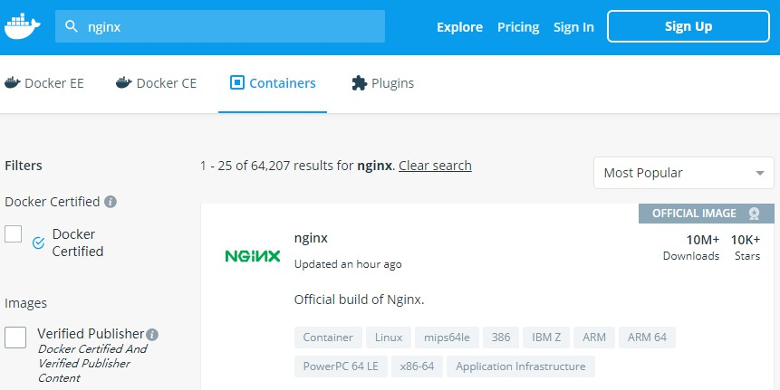
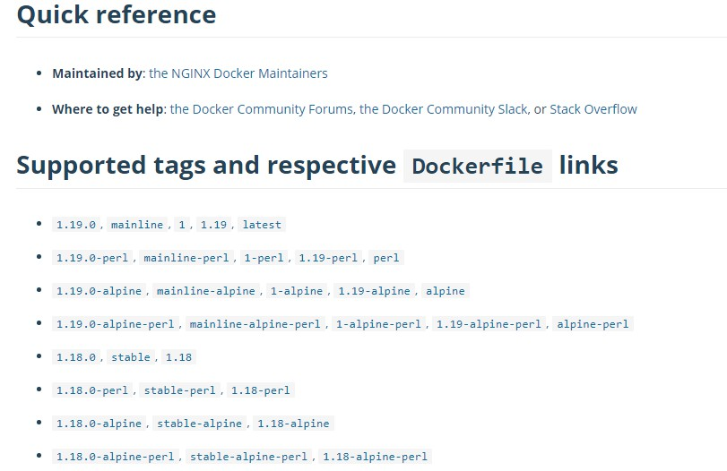

## Docker简介
Docker是开源的应用容器引擎，让开发者可以打包应用到一个可移植的镜像中，然后发布到linux或者windows机器上，使用
Docker可以方便打包，测试及应用部署
### docker和虚拟机
<table>
<thead>
<tr>
<th style="text-align:left"></th>
<th style="text-align:left">docker</th>
<th style="text-align:left">虚拟机</th>
</tr>
</thead>
<tbody>
<tr>
<td style="text-align:left">相同点</td>
<td style="text-align:left">1. 都可在不同的主机之间迁移<br>2. 都具备 root 权限<br>3. 都可以远程控制<br>4. 都有备份、回滚操作<br></td>
</tr>
<tr>
<td style="text-align:left">操作系统</td>
<td style="text-align:left">在性能上有优势，可以轻易的运行多个操作系统</td>
<td style="text-align:left">可以安装任何系统，但是性能不及容器</td>
</tr>
<tr>
<td style="text-align:left">原理</td>
<td style="text-align:left">和宿主机共享内核，所有容器运行在容器引擎之上，容器并非一个完整的操作系统，所有容器共享操作系统，在进程级进行隔离</td>
<td style="text-align:left">每一个虚拟机都建立在虚拟的硬件之上，提供指令级的虚拟，具备一个完整的操作系统</td>
</tr>
<tr>
<td style="text-align:left">优点</td>
<td style="text-align:left">高效、集中。一个硬件节点可以运行数以百计的的容器，非常节省资源，QoS 会尽量满足，但不保证一定满足。内核由提供者升级，服务由服务提供者管理</td>
<td style="text-align:left">对操作系统具有绝对权限，对系统版本和系统升级具有完全的管理权限。具有一整套的的资源：CPU、RAM 和磁盘。QoS 是有保证的，每一个虚拟机就像一个真实的物理机一样，可以实现不同的操作系统运行在同一物理节点上。</td>
</tr>
<tr>
<td style="text-align:left">资源管理</td>
<td style="text-align:left">弹性资源分配：资源可以在没有关闭容器的情况下添加，数据卷也无需重新分配大小</td>
<td style="text-align:left">虚拟机需要重启，虚拟机里边的操作系统需要处理新加入的资源，如磁盘等，都需要重新分区。</td>
</tr>
<tr>
<td style="text-align:left">远程管理</td>
<td style="text-align:left">根据操作系统的不同，可以通过 shell 或者远程桌面进行</td>
<td style="text-align:left">远程控制由虚拟化平台提供，可以在虚拟机启动之前连接</td>
</tr>
<tr>
<td style="text-align:left">缺点</td>
<td style="text-align:left">对内核没有控制权限，只有容器的提供者具备升级权限。只有一个内核运行在物理节点上，几乎不能实现不同的操作系统混合。容器提供者一般仅提供少数的几个操作系统</td>
<td style="text-align:left">每一台虚拟机都具有更大的负载，耗费更多的资源，用户需要全权维护和管理。一台物理机上能够运行的虚拟机非常有限</td>
</tr>
<tr>
<td style="text-align:left">配置</td>
<td style="text-align:left">快速，基本上是一键配置</td>
<td style="text-align:left">配置时间长</td>
</tr>
<tr>
<td style="text-align:left">启动时间</td>
<td style="text-align:left">秒级</td>
<td style="text-align:left">分钟级</td>
</tr>
<tr>
<td style="text-align:left">硬盘使用</td>
<td style="text-align:left">MB</td>
<td style="text-align:left">GB</td>
</tr>
<tr>
<td style="text-align:left">性能</td>
<td style="text-align:left">接近原生态</td>
<td style="text-align:left">弱于原生态</td>
</tr>
<tr>
<td style="text-align:left">系统支持数量</td>
<td style="text-align:left">单机支持上千个</td>
<td style="text-align:left">一般不多于几十个</td>
</tr>
</tbody>
</table><br>

### Docker应用场景
1. 加速本地开发
2. 自动打包和部署应用
3. 创建轻量，私有的Paas环境
4. 自动化测试和持续集成/部署
5. 部署并扩展Web应用，数据库和后端服务器
6. 创建安全沙盒
7. 轻量级的桌面虚拟化
### Docker核心组件
- 镜像
镜像是一个只读的静态模板，保存了容器需要的环境和应用的执行代码
- 容器
容器是一个运行时环境，是镜像的一个运行状态，是镜像执行的动态表现
- 库
库是用户存储镜像的目录，一个用户可以建立多个库保存自己的镜像
## Docker环境安装
- 安装yum-utils
```
yum install -y yum-utils device-mapper-persistent-data lvm2
```
- 为yum源添加docker仓库位置
```
yum-config-manager --add-repo https://download.docker.com/linux/centos/docker-ce.repo
```
- 安装docker
```
yum install docker-ce
```
- 启动docker
```
systemctl start docker
```
## Docker常用命令
### 搜索镜像
```
docker search java 
```
```
[root@localhost ~]# docker search java
NAME                                     DESCRIPTION                                     STARS               OFFICIAL            AUTOMATED
node                                     Node.js is a JavaScript-based platform for s…   8986                [OK]                
tomcat                                   Apache Tomcat is an open source implementati…   2770                [OK]                
openjdk                                  OpenJDK is an open-source implementation of …   2321                [OK]                
java                                     Java is a concurrent, class-based, and objec…   1976                [OK]                
ghost                                    Ghost is a free and open source blogging pla…   1204                [OK]                
couchdb                                  CouchDB is a database that uses JSON for doc…   352                 [OK]                
jetty                                    Jetty provides a Web server and javax.servle…   337                 [OK]                
groovy                                   Apache Groovy is a multi-faceted language fo…   97                  [OK]                
lwieske/java-8                           Oracle Java 8 Container - Full + Slim - Base…   46                                      [OK]
nimmis/java-centos                       This is docker images of CentOS 7 with diffe…   42                                      [OK]
fabric8/java-jboss-openjdk8-jdk          Fabric8 Java Base Image (JBoss, OpenJDK 8)      28                                      [OK]
...
```
### 下载镜像
```
docker pull java:8
```
### 查找镜像支持的版本
- 进入docker hub官网，地址(https://hub.docker.com)
- 搜索镜像<br>
<br>
<br>
- 镜像下载
```
docker pull nginx:1.19.0
```
### 列出镜像
```
[root@localhost ~]# docker images
REPOSITORY          TAG                 IMAGE ID            CREATED             SIZE
nginx               1.19.0              2622e6cca7eb        3 weeks ago         132MB
[root@localhost ~]# 
```
### 删除镜像
- 指定名称删除
```
[root@localhost ~]# docker images
REPOSITORY          TAG                 IMAGE ID            CREATED             SIZE
nginx               1.19.0              2622e6cca7eb        3 weeks ago         132MB
java                8                   d23bdf5b1b1b        3 years ago         643MB
[root@localhost ~]# docker rmi java:8
Untagged: java:8
Untagged: java@sha256:c1ff613e8ba25833d2e1940da0940c3824f03f802c449f3d1815a66b7f8c0e9d
Deleted: sha256:d23bdf5b1b1b1afce5f1d0fd33e7ed8afbc084b594b9ccf742a5b27080d8a4a8
Deleted: sha256:0132aeca1bc9ac49d397635d34675915693a8727b103639ddee3cc5438e0f60a
Deleted: sha256:c011315277e16e6c88687a6c683e388e2879f9a195113129a2ca12f782d9fcf9
Deleted: sha256:3181aa7c07970b525de9d3bd15c4c3710a2ab49fd5927df41e5586d9b89b1480
Deleted: sha256:b0053647bc72f97b7a9709a505a20a7a74a556c6aa025979e36532ff3df7cb8d
Deleted: sha256:0877f4904e80b44741cc07706b19c6d415724b20128f4b26ee59faec9a859416
Deleted: sha256:dbf7b16cf5d32dfec3058391a92361a09745421deb2491545964f8ba99b37fc2
Deleted: sha256:4cbc0ad7007fe8c2dfcf2cdc82fdb04f35070f0e2a04d5fa35093977a3cc1693
Deleted: sha256:a2ae92ffcd29f7ededa0320f4a4fd709a723beae9a4e681696874932db7aee2c
[root@localhost ~]# 
```
- 指定名称删除：强制
```
docker rmi -f java:8
```
- 删除所有没有引用的镜像
```
docker rmi `docker images | grep none | awk '{pring $3}'`
```
- 强制删除所有镜像
```
docker rmi -f ${docker images}
```
### 修改Docker镜像存放位置
- 查看Docker镜像存放位置
```
[root@localhost ~]# docker info | grep "Docker Root Dir"
 Docker Root Dir: /var/lib/docker
```
- 关闭Docker服务
`systemctl stop docker`
- 移动目录到目标路径
`mv /var/lib/docker /mydata/docker`
- 建立软连接
`ln -s /mydata/docker /var/lib/docker`

## Docker容器常用命令
### 新建并启动容器
容器新建之后不需要再建
```
docker run -p 80:80 --name nginx -d nginx:1.19.0
```
- -d:后台运行
- --name:指定容器的名字，之后可以通过名字来操作容器
- -p:指定端口映射，格式为hostPort:containerPort
### 列出容器
- 列出运行中容器
```
[root@localhost ~]# docker ps
CONTAINER ID        IMAGE               COMMAND                  CREATED             STATUS              PORTS                NAMES
828384d37220        nginx:1.19.0        "/docker-entrypoint.…"   24 hours ago        Up 21 seconds       0.0.0.0:80->80/tcp   nginx
```
- 列出所有容器
```
[root@localhost ~]# docker ps -a
```
### 停止容器
docker stop $ContainerName（或者$ContainerId)
```
[root@localhost ~]# docker stop nginx
nginx
[root@localhost ~]# docker ps
CONTAINER ID        IMAGE               COMMAND             CREATED             STATUS              PORTS               NAMES
[root@localhost ~]# docker ps -a
CONTAINER ID        IMAGE               COMMAND                  CREATED             STATUS                     PORTS               NAMES
828384d37220        nginx:1.19.0        "/docker-entrypoint.…"   24 hours ago        Exited (0) 6 seconds ago                       nginx
[root@localhost ~]# 
```
### 强制停止容器
```
[root@localhost ~]# docker start nginx
nginx
[root@localhost ~]# docker ps
CONTAINER ID        IMAGE               COMMAND                  CREATED             STATUS              PORTS                NAMES
828384d37220        nginx:1.19.0        "/docker-entrypoint.…"   25 hours ago        Up 3 seconds        0.0.0.0:80->80/tcp   nginx
[root@localhost ~]# docker kill nginx
nginx
[root@localhost ~]# docker ps
CONTAINER ID        IMAGE               COMMAND             CREATED             STATUS              PORTS               NAMES
[root@localhost ~]# 
```
### 启动已停止的容器
docker start $ContainerName（或者$ContainerId)
```
[root@localhost ~]# docker start nginx
nginx
[root@localhost ~]# docker ps
CONTAINER ID        IMAGE               COMMAND                  CREATED             STATUS              PORTS                NAMES
828384d37220        nginx:1.19.0        "/docker-entrypoint.…"   25 hours ago        Up 3 seconds        0.0.0.0:80->80/tcp   nginx
[root@localhost ~]#
```
### 进入容器
- 先查询出容器的pid
```
[root@localhost ~]# docker inspect --format "{{.State.Pid}}" nginx
53590
```
- 根据pid进入容器
```
[root@localhost ~]# docker inspect --format "{{.State.Pid}}" nginx
53590
[root@localhost ~]# nsenter --target 53590 --mount --uts --ipc --net --pid
mesg: ttyname failed: No such device
root@828384d37220:/# 
```
### 删除容器
- 删除指定容器
```
docker rm $ContainerName(或者$ContainerId)
```
- 按名称删除容器
```
docker rm `docker ps -a | grep mall-* | awk '{print $1}'`
```
- 强制删除所有容器
```
docker rm -f $(docker ps -a -q)
```
### 查看容器的日志
- 查看当前全部日志
```
docker logs $ContainerName(或者$ContainerId)
```
- 动态查看日志
```
docker logs $ContainerName(或者$ContainerId) -f
```
```
[root@localhost ~]# docker logs nginx
/docker-entrypoint.sh: /docker-entrypoint.d/ is not empty, will attempt to perform configuration
/docker-entrypoint.sh: Looking for shell scripts in /docker-entrypoint.d/
/docker-entrypoint.sh: Launching /docker-entrypoint.d/10-listen-on-ipv6-by-default.sh
10-listen-on-ipv6-by-default.sh: Getting the checksum of /etc/nginx/conf.d/default.conf
10-listen-on-ipv6-by-default.sh: Enabled listen on IPv6 in /etc/nginx/conf.d/default.conf
/docker-entrypoint.sh: Launching /docker-entrypoint.d/20-envsubst-on-templates.sh
/docker-entrypoint.sh: Configuration complete; ready for start up
```
### 查看容器的ip
```
[root@localhost ~]# docker inspect --format '{{ .NetworkSettings.IPAddress }}' nginx
172.17.0.2
```
### 修改容器的启动方式
```
docker container update --restart=always $ContainerName

```
### 指定容器时区
```
docker run -p 80:80 --name nginx \
-e TZ="Asia/Shanghai" \
-d nginx:1.19.0
```
##宿主机查看docker
### 查看指定容器
docker stats $ContainerName(或者$ContainerId)
```
[root@localhost ~]# docker stats nginx
```
### 查看所有容器
```
docker stats -a
```
### 查看docker磁盘使用
```
[root@localhost ~]# docker system df
TYPE                TOTAL               ACTIVE              SIZE                RECLAIMABLE
Images              1                   1                   132.1MB             0B (0%)
Containers          1                   1                   1.158kB             0B (0%)
Local Volumes       0                   0                   0B                  0B
Build Cache         0                   0                   0B                  0B
```
### 使用账号进入Docker容器
```
[root@localhost ~]# docker exec -it --user root nginx /bin/bash
root@828384d37220:/# 
```
### 创建外部网络
```
docker network create -d bridge my-bridge-network
```

