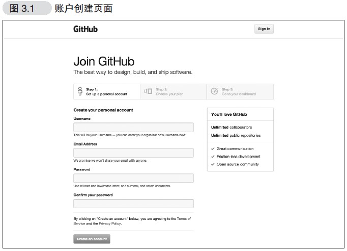
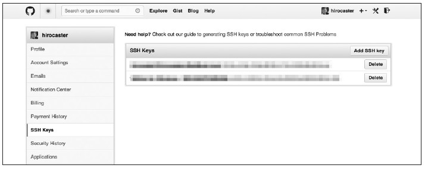
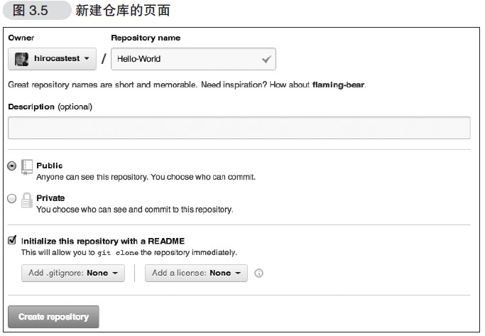
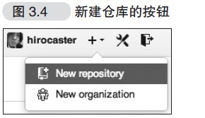

## 基本介绍
学习自《github入门与实践》笔记
### git与gitHub的区别
github是提供了一种服务，包括代码托管，提供一些功能帮助高效编写代码,仓库管理是核心功能<br>
git用来管理这种服务
### github提供的功能
- 建立git仓库，进行仓库管理
- Issue 任务的跟踪与管理
- Wiki 编写文档，能够被git管理
- Pull Request 和其他人交互
## 初始设置
### 安装
略...
### 设置姓名和邮箱
名字使用英文,姓名和邮箱会公开在提交日志中
```
$ git config --global user.name "Firstname Lastname"
$ git config --global user.email "your_email@example.com"
```
也可以在配置文件中更改~/.gitconfig
```
[user]
name = Firstname Lastname
email = your_email@example.com
```
提高可读性
```
$ git config --global color.ui auto
```
## 前期准备
### 创建账号

### 设置 SSH Key
GitHub 上连接已有仓库时的认证，是通过使用了SSH 的公开密钥
认证方式进行的
创建ssh key
```
$ ssh-keygen -t rsa -C "your_email@example.com"
Generating public/private rsa key pair.
Enter file in which to save the key
(/Users/your_user_directory/.ssh/id_rsa): 按回车键
Enter passphrase (empty for no passphrase): 输入密码
Enter same passphrase again: 再次输入密码
```
输入密码后会出现以下结果
```
Your identification has been saved in /Users/your_user_directory/.ssh/id_rsa.
Your public key has been saved in /Users/your_user_directory/.ssh/id_rsa.pub.
The key fingerprint is:
fingerprint值 your_email@example.com
The key's randomart image is:
```
id_rsa 文件是私有密钥，id_rsa.pub 是公开密钥
### 添加公开密钥
在GitHub 中添加公开密钥，今后就可以用私有密钥进行认证了
在github网站account setting中选择ssh keys菜单，粘贴公开密钥的内容

### 添加完成测试
```
$ ssh -T git@github.com
The authenticity of host 'github.com (207.97.227.239)' can't be established.
RSA key fingerprint is fingerprint值 .
Are you sure you want to continue connecting (yes/no)? 输入yes
```
### 使用社区功能
follow 了解用户的活动
watch 了解开发信息
### 创建仓库

<br>

### clone已有仓库
```
$ git clone git@github.com:hirocastest/Hello-World.git
Cloning into 'Hello-World'...
remote: Counting objects: 3, done.
remote: Total 3 (delta 0), reused 0 (delta 0)
Receiving objects: 100% (3/3), done.
$ cd Hello-World
```
### 使用流程
1. 创建git账号
2. 配置ssh keys
3. 创建仓库
4. 把仓库clone到本地
5. 本地仓库中code
6. 在本地仓库推送到github仓库
### 注意点
- clone认证成功后，仓库便会被clone 至仓库名后的目录中。将想要公开的代码提交至这个仓库再push 到GitHub 的仓库中，代码便会被公开

