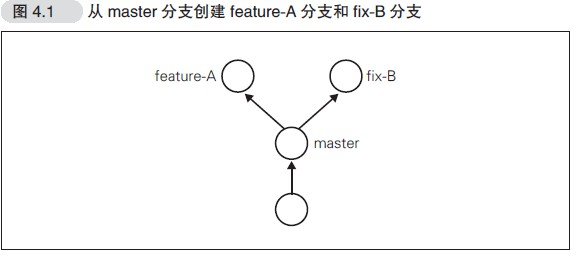
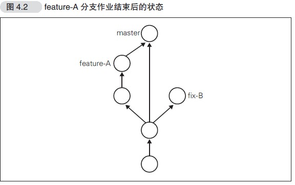
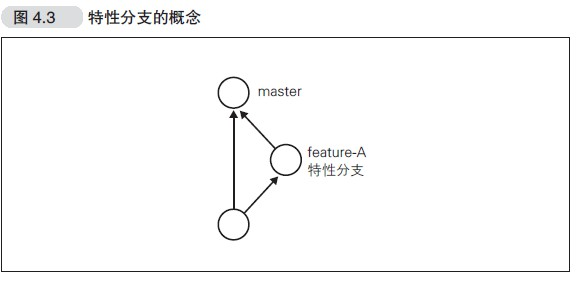
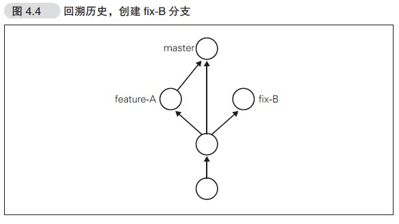

## 分支的操作
在进行多个并行作业时，我们会用到分支。在这类并行开发的过程
中，往往同时存在多个最新代码状态。如图4.1 所示，从master 分支创
建feature-A 分支和fix-B 分支后，每个分支中都拥有自己的最新代码。
master 分支是Git 默认创建的分支，因此基本上所有开发都是以这个分
支为中心进行的。<br>
<br>
不同分支中，可以同时进行完全不同的作业。等该分支的作业完成
之后再与master 分支合并。比如feature-A 分支的作业结束后与master
合并，如图4.2 所示<br>
<br>
### git branch——显示分支一览表
```
$ git branch
* master
```
可以看到master 分支左侧标有“*”（星号），表示这是我们当前所
在的分支。也就是说，我们正在master 分支下进行开发。结果中没有显
示其他分支名，表示本地仓库中只存在master 一个分支。
### git checkout -b——创建、切换分支
如果想以当前的master 分支为基础创建新的分支，我们需要用到git checkout -b命令。<br>
创建分支
`git branch feature-A`
切换分支
`git checkout feature-A`

### 切换到feature-A 分支并进行切换
```
$ git checkout -b feature-A
Switched to a new branch 'feature-A'
```
```
$ git branch
* feature-A
  master
```
feature-A 分支左侧标有“*”，表示当前分支为feature-A。在这个状
态下像正常开发那样修改代码、执行git add命令并进行提交的话，
代码就会提交至feature-A 分支。像这样不断对一个分支（例如
feature-A）进行提交的操作，我们称为“培育分支”。
#### 测试在新建分支上修改README.md
在README.md中添加feature-A<br>
比较工作区与最新提交的区别
```
$ git diff HEAD
diff --git a/README.md b/README.md
index f9bb8d9..86e6f51 100644
--- a/README.md
+++ b/README.md
@@ -1,2 +1,3 @@
 aaa
 git 教程
+feature-A
```
提交
```
$ git add README.md
$ git commit -m "feature-A test"
[feature-A 667b003] feature-A test
 1 file changed, 1 insertion(+)
```
查看feature-A分支中README.md文件
```
$ cat README.md
aaa
git 教程
feature-A
```
切换到master分支，查看README.md文件
```
$ git checkout master
Switched to branch 'master'
$ cat README.md
aaa
git 教程
```
可见在feature-A分支中对文件的修改，在分支master中没有影响
### 特性分支
特性分支顾名思义，是集中实现单一特性（主题），除此之外不进
行任何作业的分支。在日常开发中，往往会创建数个特性分支，同时在
此之外再保留一个随时可以发布软件的稳定分支。稳定分支的角色通常
由master 分支担当<br>
<br>
之前我们创建了feature-A 分支，这一分支主要实现feature-A，除
feature-A 的实现之外不进行任何作业。即便在开发过程中发现了BUG，
也需要再创建新的分支，在新分支中进行修正。
基于特定主题的作业在特性分支中进行，主题完成后再与master 分
支合并。只要保持这样一个开发流程，就能保证master 分支可以随时供
人查看。这样一来，其他开发者也可以放心大胆地从master 分支创建新
的特性分支.
### 主干分支
主干分支是刚才我们讲解的特性分支的原点，同时也是合并的终
点。通常人们会用master 分支作为主干分支。主干分支中并没有开发到
一半的代码，可以随时供他人查看。
有时我们需要让这个主干分支总是配置在正式环境中，有时又需要
用标签Tag 等创建版本信息，同时管理多个版本发布。拥有多个版本发
布时，主干分支也有多个
### git merge——合并分支
我们假设feature-A 已经实现完毕，想要将它合并到主干分
支master 中。首先切换到master 分支。
```
$ git checkout master
Already on 'master'
```
查看所在分支
```
$ git branch
   feature-A
 * master
```
合并feature-A,为了在历史记录中明确记录下本次分支合并，
我们需要创建合并提交。因此，在合并时加上--no-ff参数,随后编辑器会启动,将编辑器中显示的内容保存，关闭编辑器
```
$ git merge --no-ff feature-A
Merge made by the 'recursive' strategy.
 README.md | 1 +
 1 file changed, 1 insertion(+)
```
### git log --graph——以图表形式查看分支
```
$ git log --graph
*   commit fa1e4465ddfd71346f3d9ca365d57c9c74f22e93 (HEAD -> master)
|\  Merge: f420c24 667b003
| | Author: yanxiaose <ybclaji@126.com>
| | Date:   Wed Jun 24 11:30:18 2020 +0800
| |
| |     Merge branch 'feature-A'
| |
| * commit 667b003a237c586141308728dd3c98d8b36e3a05 (feature-A)
|/  Author: yanxiaose <ybclaji@126.com>
|   Date:   Wed Jun 24 11:19:44 2020 +0800
|
|       feature-A test
|
* commit f420c24ffe530e184eebc98b739033d078ac643c
| Author: yanxiaose <ybclaji@126.com>
| Date:   Wed Jun 24 10:55:55 2020 +0800
|
|     add git 教程
|
* commit 7f87d4c0a61f9d6d92d9098634c77d21bb367273
| Author: yanxiaose <ybclaji@126.com>
| Date:   Tue Jun 23 16:50:24 2020 +0800
|
|     不使用-m参数提交
|
* commit 97989858097c04ddbf14d55a5d3d7cc4973b80f8
  Author: yanxiaose <ybclaji@126.com>
  Date:   Tue Jun 23 16:48:44 2020 +0800

      first commit
(END)
```
### git reset——回溯历史版本
在这里，为了让各位熟悉对历史版本的操作，我们先回溯历史版
本，创建一个名为fix-B 的特性分支（图4.4）。<br>

#### 回溯到创建feature-A 分支前
让我们先回溯到上一节feature-A 分支创建之前，创建一个名为
fix-c 的特性分支,要让仓库的HEAD、暂存区、当前工作树回溯到指定状态，需要用
到git rest --hard命令<br>
查看log，git log命令只能查看以当前状态为终点的历史日志，所以这里
要使用git reflog命令，查看当前仓库的操作日志。
``` 
 git reflog
75823a6 (HEAD -> master) HEAD@{0}: commit (merge): fix conflict
fa1e446 HEAD@{1}: reset: moving to fa1e446
f420c24 HEAD@{2}: checkout: moving from fa1e4465ddfd71346f3d9ca365d57c9c74f22e93 to master
fa1e446 HEAD@{3}: checkout: moving from master to fa1e446
f420c24 HEAD@{4}: checkout: moving from fix-B to master
f100bc7 (fix-B) HEAD@{5}: checkout: moving from fa1e4465ddfd71346f3d9ca365d57c9c74f22e93 to fix-B
fa1e446 HEAD@{6}: checkout: moving from fix-B to fa1e446
f100bc7 (fix-B) HEAD@{7}: commit: fix -B
f420c24 HEAD@{8}: checkout: moving from master to fix-B
f420c24 HEAD@{9}: reset: moving to f420c24
fa1e446 HEAD@{10}: merge feature-A: Merge made by the 'recursive' strategy.
f420c24 HEAD@{11}: checkout: moving from master to master
f420c24 HEAD@{12}: checkout: moving from feature-A to master
667b003 (feature-A) HEAD@{13}: commit: feature-A test
f420c24 HEAD@{14}: checkout: moving from master to feature-A
f420c24 HEAD@{15}: commit: add git 教程
7f87d4c HEAD@{16}: commit: 不使用-m参数提交
9798985 HEAD@{17}: commit (initial): first commit
```
回到f420c24,即创建feature-A之前
```
$ git reset --hard f420c24
HEAD is now at f420c24 add git µòÖτ¿ï
```
查看日志，发现日志少了，只以当前为终点
```
$ git log
commit f420c24ffe530e184eebc98b739033d078ac643c (HEAD -> master)
Author: yanxiaose <ybclaji@126.com>
Date:   Wed Jun 24 10:55:55 2020 +0800

    add git 教程

commit 7f87d4c0a61f9d6d92d9098634c77d21bb367273
Author: yanxiaose <ybclaji@126.com>
Date:   Tue Jun 23 16:50:24 2020 +0800

    不使用-m参数提交

commit 97989858097c04ddbf14d55a5d3d7cc4973b80f8
Author: yanxiaose <ybclaji@126.com>
Date:   Tue Jun 23 16:48:44 2020 +0800

    first commit

```
创建fix-C分支
```
$ git checkout -b fix-C
Switched to a new branch 'fix-C'
```
修改文件readme.md加上fix-c提交
```
$ git commit -m "fix-c"
[fix-C 53917a4] fix-c
 1 file changed, 1 insertion(+)
```
想把fix-c分支合并到哪？到master合并feature-A之后,先回到master,在使用git reset --hard恢复到了回溯前的历史状态
```
$ git checkout master
Switched to branch 'master'
$ git reset --hard 75823a6
HEAD is now at 75823a6 fix conflict
```
查看日志,发现日志都回来了
```
$ git log
commit 75823a69ba2a0a89dbaf74bd5a866e9eb41a69e8 (HEAD -> master)
Merge: fa1e446 f100bc7
Author: yanxiaose <ybclaji@126.com>
Date:   Wed Jun 24 14:08:51 2020 +0800

    fix conflict

commit f100bc70212989964e290d2ce5f1ca5a1c6f122d (fix-B)
Author: yanxiaose <ybclaji@126.com>
Date:   Wed Jun 24 13:50:33 2020 +0800

    fix -B

commit fa1e4465ddfd71346f3d9ca365d57c9c74f22e93
Merge: f420c24 667b003
Author: yanxiaose <ybclaji@126.com>
Date:   Wed Jun 24 11:30:18 2020 +0800

    Merge branch 'feature-A'

commit 667b003a237c586141308728dd3c98d8b36e3a05 (feature-A)
Author: yanxiaose <ybclaji@126.com>
Date:   Wed Jun 24 11:19:44 2020 +0800
:
```
合并fix-C
```
$ git merge --no-ff fix-C
Auto-merging README.md
CONFLICT (content): Merge conflict in README.md
Automatic merge failed; fix conflicts and then commit the result.
```
查看冲突，并解决提交
```
$ vi README.md
$ git add README.md
$ git commit -m "Fix conflict"
Recorded resolution for 'README.md'.
[master 6a97e48] Fix conflict
```
### git rebase -i——压缩历史
在合并特性分支之前，如果发现已提交的内容中有些许拼写错误等，
不妨提交一个修改，然后将这个修改包含到前一个提交之中，压缩成一
个历史记录
#### 创建feature-C分支
```
$ git checkout -b feature-C
Switched to a new branch 'feature-C'
$ vi README.md
$ cat README.md
aaa
git 教程
feature-A
fix-B
-fix-c
-faeture-C
```
上面故意留下拼写错误<br>
提交
```
$ git commit -am "add feature-C"
[feature-C edf55a1] add feature-C
 1 file changed, 1 insertion(+)
```
修正拼写错误
```
$ git diff
diff --git a/README.md b/README.md
index 093a6d3..f81cdf8 100644
--- a/README.md
+++ b/README.md
@@ -3,4 +3,4 @@ git 教程
 feature-A
 fix-B
 -fix-c
--faeture-C
+-feature-C
```
然后进行提交
```
$ git commit -am "fix typo"
[feature-C 2eb821b] fix typo
 1 file changed, 1 insertion(+), 1 deletion(-)
```
实际上，我们不希望在历史记录中看到这类提交，因为健全的历史记录
并不需要它们。如果能在最初提交之前就发现并修正这些错误，也就不
会出现这类提交了
#### 更改历史提交
将"Fix typo"修正的内容与之前一次的
提交合并，在历史记录中合并为一次完美的提交。为此，我们要用到
git rebase命令
```
$ git rebase -i HEAD~2
```

```
pick edf55a1 add feature-C
fixup 2eb821b fix typo

# Rebase cbf6e75..2eb821b onto cbf6e75 (2 commands)
#
# Commands:
# p, pick <commit> = use commit
# r, reword <commit> = use commit, but edit the commit message
# e, edit <commit> = use commit, but stop for amending
# s, squash <commit> = use commit, but meld into previous commit
# f, fixup <commit> = like "squash", but discard this commit's log message
# x, exec <command> = run command (the rest of the line) using shell
# b, break = stop here (continue rebase later with 'git rebase --continue')
# d, drop <commit> = remove commit
# l, label <label> = label current HEAD with a name
# t, reset <label> = reset HEAD to a label
# m, merge [-C <commit> | -c <commit>] <label> [# <oneline>]
# .       create a merge commit using the original merge commit's
# .       message (or the oneline, if no original merge commit was
# .       specified). Use -c <commit> to reword the commit message.
#
# These lines can be re-ordered; they are executed from top to bottom.
#
# If you remove a line here THAT COMMIT WILL BE LOST.
#
# However, if you remove everything, the rebase will be aborted.
#
```
我们将6fba227 的Fix typo 的历史记录压缩到7a34294 的Add feature-C
里。2eb821b 左侧的pick 部分删除，改写为fixup。<br>
压缩成功
```
$ git rebase -i HEAD~2
Successfully rebased and updated refs/heads/feature-C.

```
查看日志，可以看到之前修改字母的提交消失了，合并到了前一个提交
```
$ git log
commit 43535ed2199f64313351ce0cef945025670814da (HEAD -> feature-C)
Author: yanxiaose <ybclaji@126.com>
Date:   Wed Jun 24 14:45:11 2020 +0800

    add feature-C

commit cbf6e75d6b72855803d90dc9b2376aaf1099632d (master)
Merge: 75823a6 53917a4
Author: yanxiaose <ybclaji@126.com>
Date:   Wed Jun 24 14:41:10 2020 +0800

    fix conflict
```
合并至master
```
$ git checkout master
Switched to branch 'master'
$ git merge --no-ff feature-C
Merge made by the 'recursive' strategy.
 README.md | 1 +
 1 file changed, 1 insertion(+)

```