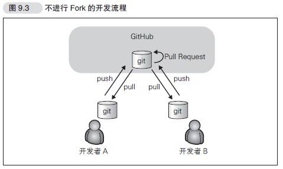
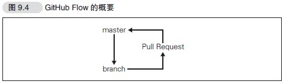
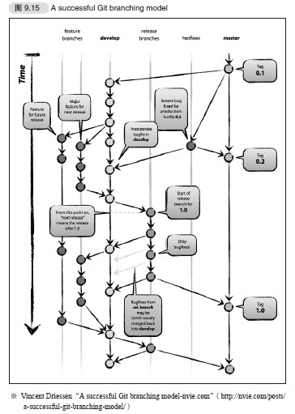

## 使用GitHub的开发流程
### 不Fork仓库的方法
在无法给提交人赋予提交权限的公开软件开发中，这种流程能够防止仓库收到计划之外的提交
1. 在GitHub上进行Fork
2. 将1的仓库clone至本地开发环境
3. 在本地环境中创建特性分支
4. 对特性分支进行代码修改并进行提交
5. 将特性分支push到1的仓库中
6. 在GitHub上对Fork来源仓库发送Pull Request

### 以部署为中心的开发模式(GitHub Flow)

1. 令master分支时常处于可以部署的状态
2. 进行新的作业要从master分支创建新分支，分支名称要具有描述性
3. 在2新建的本地仓库分支中进行提交
4. 在GitHub端仓库创建同名分支，定期push
5. 需要帮助或者反馈时创建Pull Request进行交流
6. 让其他开发者进行审查，确认完成后与master分支合并
7. 与master合并后立刻部署
### 以发布为中心的开发模式

1. 从开发版(develop)创建工作分支(feature branches),进行功能的实现或者修正
2. 工作分支(feature branches)的修改结束后，与开发板的分支合并
3. 重复1,2直到可以发布
4. 创建用于发布的分支(release branches),处理发布的各项工作
5. 发布完成后与master分支合并，打上版本标签进行发布
6. 如果发布的软件出现bug,以打了标签的版本为基础进行修正(hotfixes)
