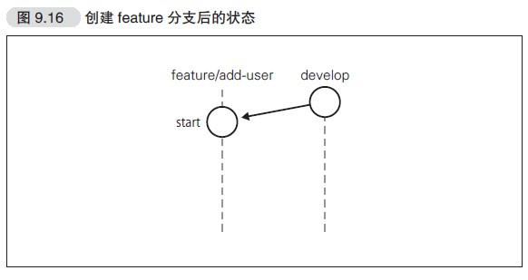
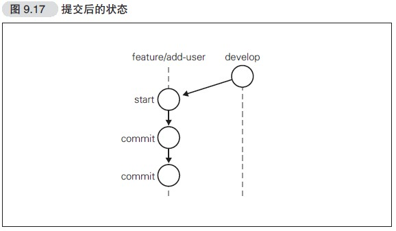
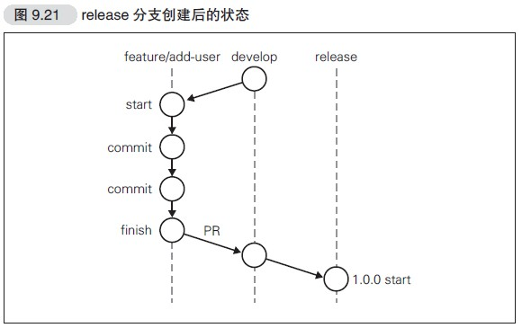
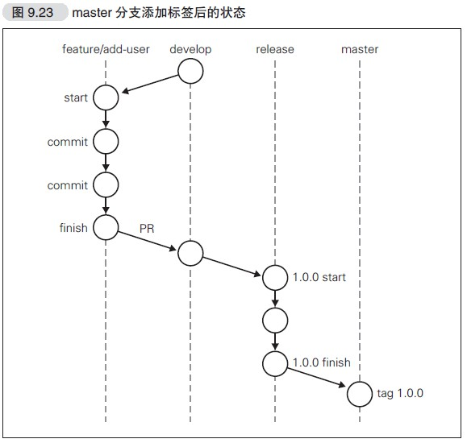
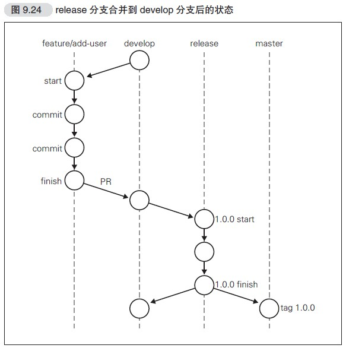
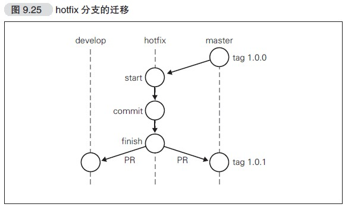
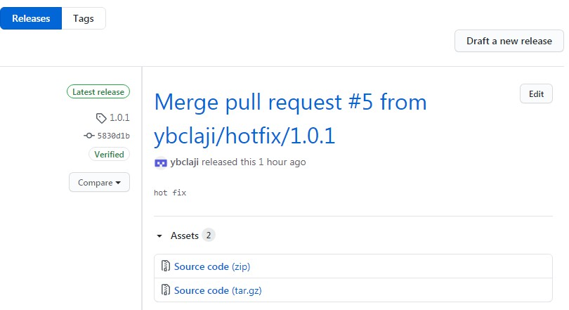
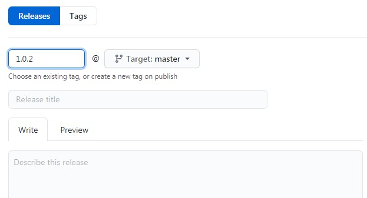
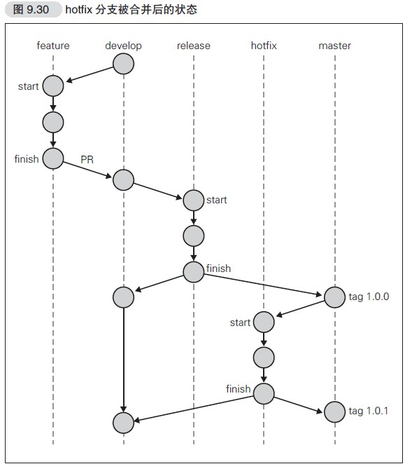

## git-flow使用准备
### 安装git客户端
确认安装
```
$ git flow
usage: git flow <subcommand>

Available subcommands are:
   init      Initialize a new git repo with support for the branching model.
   feature   Manage your feature branches.
   bugfix    Manage your bugfix branches.
   release   Manage your release branches.
   hotfix    Manage your hotfix branches.
   support   Manage your support branches.
   version   Shows version information.
   config    Manage your git-flow configuration.
   log       Show log deviating from base branch.

Try 'git flow <subcommand> help' for details.
```
### 仓库设置
1. 在GitHub上创建仓库（附带README.md）,然后clone该仓库
```
$ git clone git@github.com:hirocaster/blog.git
Cloning into 'blog'...
remote: Counting objects: 3, done.
remote: Total 3 (delta 0), reused 0 (delta 0)
Receiving objects: 100% (3/3), done.
Checking connectivity... done.
```
2. 进行git flow初始设置
```
$ cd blog
$ git flow init -d
Using default branch names.
Which branch should be used for bringing forth production releases?
- master
Branch name for production releases: [master]
Branch name for "next release" development: [develop]
How to name your supporting branch prefixes?
Feature branches? [feature/]
Release branches? [release/]
Hotfix branches? [hotfix/]
Support branches? [support/]
Version tag prefix? []
```
查看分支
```
$ git branch -a
* develop
master
remotes/origin/HEAD -> origin/master
remotes/origin/master
```
3. 利用本地分支创建远程分支
```
$ git push -u origin develop
Total 0 (delta 0), reused 0 (delta 0)
To git@github.com:hirocaster/blog.git
* [new branch] develop -> develop
Branch develop set up to track remote branch develop from origin.
$ git branch -a
* develop ←本地的develop分支
master ←本地的master分支
remotes/origin/HEAD -> origin/master
remotes/origin/develop ←GitHub端的develop分支
remotes/origin/master ←GitHub端的master分支
```
## 模拟git flow
### master与develop区别
- master保持软件可以正常运行，不允许直接对master分支进行提交和修改
- develop是开发的代码中心分支，同样不允许直接提交和修改
- 开发者要以develop分支为起点新建feature分支，在feature分支中进行新功能的开发，修正
### 在feature中工作流程
1. 从develop分支创建feature分支
2. 在feature分支实现功能
3. 通过GitHub向develop分支发送PullRequest
4. 接受审查后，合并到develop
5. 可以删除feature分支
### 创建分支
1. 保持代码最新
在develop下
```
$ git pull
Already up-to-date.
```
2. 创建feature分支
```
$ git flow feature start add-user
Switched to a new branch 'feature/add-user'
Summary of actions:
- A new branch 'feature/add-user' was created, based on 'develop'
- You are now on branch 'feature/add-user'
Now, start committing on your feature. When done, use:
git flow feature finish add-user
```

### 在分支中作业

### 发送Pull Request
    - 把feature/add-user分支push到远程仓库
    - 创建Pull Request
    - 代码审查
    - 合并分支到develop
### 更新本地develop分支
```
$ git checkout develop
Switched to branch 'develop'
$ git pull
remote: Counting objects: 1, done.
remote: Total 1 (delta 0), reused 0 (delta 0)
Unpacking objects: 100% (1/1), done.
From github.com:hirocaster/blog
ad139da..9299f28 develop -> origin/develop
Updating ad139da..9299f28
Fast-forward
add-user-1 | 0
add-user-2 | 0
2 files changed, 0 insertions(+), 0 deletions(-)
create mode 100644 add-user-1
create mode 100644 add-user-2
```
### 进入发布阶段
所有功能都添加，软件进入发布阶段，给软件分配版本号进行发布，今后对这个版本
的软件只做BUG修复
1. 创建分支
```
切换至develop分支
$ git checkout develop
Switched to branch 'develop'
获取最新develop分支的代码
$ git pull
Already up-to-date.
开始release分支
$ git flow release start '1.0.0'
Switched to a new branch 'release/1.0.0'
Summary of actions:
- A new branch 'release/1.0.0' was created, based on 'develop'
- You are now on branch 'release/1.0.0'
Follow-up actions:
- Bump the version number now!
- Start committing last-minute fixes in preparing your release
- When done, run:
git flow release finish '1.0.0'
```
<br>
2. 分支内工作
修改版本编号等，测试发现bug相关的修正提交给这个分支<br>
3. 进行发布与合并
release finish后，release分支将合并至master分支
```
$ git flow release finish '1.0.0'
```
```
Merge branch 'release/1.0.0'
# Please enter a commit message to explain why this merge is necessary,
# especially if it merges an updated upstream into a topic branch.
#
# Lines starting with '#' will be ignored, and an empty message aborts
# the commit.
```
```
Release 1.0.0
#
# Write a tag message
# Lines starting with '#' will be ignored.
#
```
<br>
随后，release分支合并至develop分支
```
Merge branch 'release/1.0.0' into develop
# Please enter a commit message to explain why this merge is necessary,
# especially if it merges an updated upstream into a topic branch.
#
# Lines starting with '#' will be ignored, and an empty message aborts
# the commit.
```
<br>
全部结束后
```
$ git flow release finish '1.0.0'
Switched to branch 'master'
Your branch is ahead of 'origin/master' by 3 commits.
(use "git push" to publish your local commits)
Merge made by the 'recursive' strategy.
release | 0
1 file changed, 0 insertions(+), 0 deletions(-)
create mode 100644 release
Switched to branch 'develop'
Your branch is up-to-date with 'origin/develop'.
Merge made by the 'recursive' strategy.
release | 0
1 file changed, 0 insertions(+), 0 deletions(-)
create mode 100644 release
Deleted branch release/1.0.0 (was 9a754a2).
Summary of actions:
- Latest objects have been fetched from 'origin'
- Release branch has been merged into 'master'
- The release was tagged '1.0.0'
- Release branch has been back-merged into 'develop'
- Release branch 'release/1.0.0' has been deleted
```
4. 查看版本标签
```
$ git tag
1.0.0
```
### 更新到远程仓库
因为对本地分支进行了修改，需要把develop,master,tags信息push到远程仓库
```
$ git push origin develop
Counting objects: 5, done.
Delta compression using up to 8 threads.
Compressing objects: 100% (3/3), done.
Writing objects: 100% (3/3), 360 bytes | 0 bytes/s, done.
Total 3 (delta 2), reused 0 (delta 0)
To git@github.com:hirocaster/blog.git
9299f28..c8add0a develop -> develop
$ git checkout master
Switched to branch 'master'
Your branch is ahead of 'origin/master' by 5 commits.
(use "git push" to publish your local commits)
$ git push origin master
Counting objects: 1, done.
Writing objects: 100% (1/1), 227 bytes | 0 bytes/s, done.
Total 1 (delta 0), reused 0 (delta 0)
To git@github.com:hirocaster/blog.git
ad139da..5651cfd master -> master
```
```
$ git push --tags
Counting objects: 1, done.
Writing objects: 100% (1/1), 163 bytes | 0 bytes/s, done.
Total 1 (delta 0), reused 0 (delta 0)
To git@github.com:hirocaster/blog.git
* [new tag] 1.0.0 -> 1.0.0
```
### hotfix分支
当前发布版本出现BUG，漏洞，需要立即处理，hotfix分支才会使用，
hotfix分支都是以发布版本标签或者master分支为起点<br>

1. 创建分支
获取远程仓库信息
```
$ git fetch origin
remote: Counting objects: 1, done.
remote: Total 1 (delta 0), reused 1 (delta 0)
Unpacking objects: 100% (1/1), done.
From github.com:hirocaster/blog
* [new tag] 1.0.0 -> 1.0.0
```
创建hotfix分支
```
$ git flow hotfix start '1.0.1' master
Switched to a new branch 'hotfix/1.0.1'
Summary of actions:
- A new branch 'hotfix/1.0.1' was created, based on '1.0.0'
- You are now on branch 'hotfix/1.0.1'
Follow-up actions:
- Bump the version number now!
- Start committing your hot fixes
- When done, run:
git flow hotfix finish '1.0.1'
```
修复工作结束，将hotfix分支push到GitHub远程仓库，并向master发送Pull Request
```
$ git push origin hotfix/1.0.1
Counting objects: 4, done.
Delta compression using up to 8 threads.
Compressing objects: 100% (2/2), done.
Writing objects: 100% (2/2), 242 bytes | 0 bytes/s, done.
Total 2 (delta 1), reused 0 (delta 0)
To git@github.com:hirocaster/blog.git
* [new branch] hotfix/1.0.1 -> hotfix/1.0.1
```
### 在GitHub上创建标签和发布
hotfix合并到master后，常见标签和发布
<br>
<br>
本地仓库获取标签，验证标签是否成功
```
$ git fetch origin
remote: Counting objects: 1, done.
remote: Total 1 (delta 0), reused 0 (delta 0)
Unpacking objects: 100% (1/1), done.
From github.com:hirocaster/blog
5651cfd..af97962 master -> origin/master
* [new tag] 1.0.1 -> 1.0.1
$ git tag
1.0.0
1.0.1
```
### hotfix分支合并到develop
因为hotfix分支是基于master，所以develop仍存在问题，具体操作很简单，只需登录GitHub，从hotfix/1.0.1 分支
向develop 分支发送Pull Request 即可。经过其他开发者的审查后，修改
内容便会被合并到develop 分支<br>



