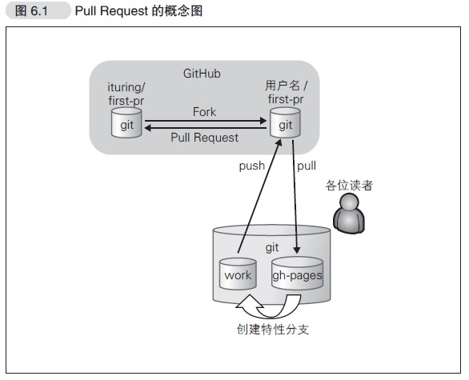
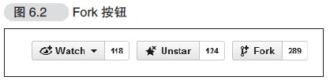
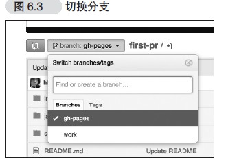
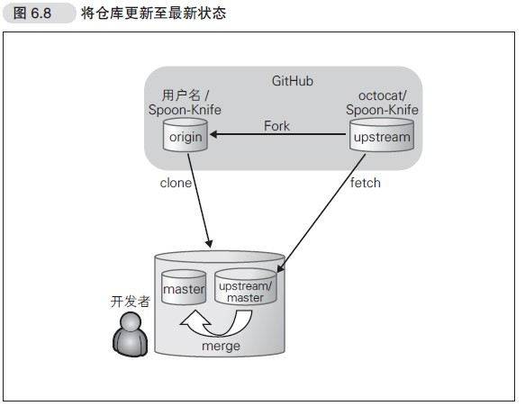

## pull request简介
### 什么是pull request
pull request 是自己修改代码后，请求对方仓库采纳代码的一种行为
### pull request流程
使用软件->发现bug->修复bug->pull request->对方采纳->成为贡献者<br>
发送pull request后，对方仓库会创建一个附带源代码的issue
### pull Request发送前的准备
流程图<br>

- fork到自己仓库<br>

- clone刚才fork的己方仓库
```
$ git clone git@github.com:hirocastest/first-pr.git
Cloning into 'first-pr'...
remote: Counting objects: 14, done.
remote: Compressing objects: 100% (12/12), done.
remote: Total 14 (delta 2), reused 0 (delta 0)
Receiving objects: 100% (14/14), 24.05 KiB, done.
Resolving deltas: 100% (2/2), done.
$ cd first-pr
``` 
- 创建特性分支，在特性分支中作业
```
$ git branch -a
   * gh-pages ←当前分支
   remotes/origin/HEAD -> origin/gh-pages
   remotes/origin/gh-pages
$ git checkout -b work gh-pages
Switched to a new branch 'work'
$ git branch -a
gh-pages
* work ←当前分支
remotes/origin/HEAD -> origin/gh-pages
remotes/origin/gh-pages   
```
- 在特性分支修改代码,提交修改
```
$ git diff
diff --git a/index.html b/index.html
index f2034b3..91b8ecb 100644
--- a/index.html
+++ b/index.html
@@ -39,6 +39,8 @@
<p>请写明这是对本书内容的实践或描述对本书的感想并发送Pull Request。</p>
+<p class="impression"> 这本书读着很有趣。（@HIROCASTER）</p>
+
省略
$ git add index.html
$ git commit -m "Add my impression"
[work 243f28d] Add my impression
1 file changed, 2 insertions(+)
```
- 创建远程分支并推送
```
$ git push origin work
Counting objects: 5, done.
Delta compression using up to 4 threads.
Compressing objects: 100% (3/3), done.
Writing objects: 100% (3/3), 353 bytes, done.
Total 3 (delta 2), reused 0 (delta 0)
To git@github.com:hirocastest/first-pr.git
* [new branch] work -> work
查看分支
$ git branch -a
master
* work
remotes/origin/HEAD -> origin/master
remotes/origin/gh-pages
remotes/origin/work ←已被创建
```
## 发送pull request
- 在github上切换到work分支，并pull request<br>

## 仓库的维护
通常来说,clone的仓库和原仓库没有任何关系，所以需要把原仓库设置为远程仓库，如果原仓库更新了，
需要从原仓库获取数据与本地仓库合并，保持本地仓库的最新状态<br>

- fork并clone
```
$ git clone git@github.com:hirocastest/Spoon-Knife.git
Cloning into 'Spoon-Knife'...
remote: Counting objects: 24, done.
remote: Compressing objects: 100% (21/21), done.
remote: Total 24 (delta 7), reused 17 (delta 1)
Receiving objects: 100% (24/24), 74.36 KiB | 68 KiB/s, done.
Resolving deltas: 100% (7/7), done.
$ cd Spoon-Knife
```
- 设置原仓库名,把原仓库添加远程仓库
```
$ git remote add upstream git://github.com/octocat/Spoon-Knife.git
```
- 获取最新数据
```
$ git fetch upstream
From git://github.com/octocat/Spoon-Knife
* [new branch] master -> upstream/master
$ git merge upstream/master
Already up-to-date.
```
后面的流程大概是创建分支，在分支上修改代码，推送到fork的仓库，然后对远程仓库进行pull request