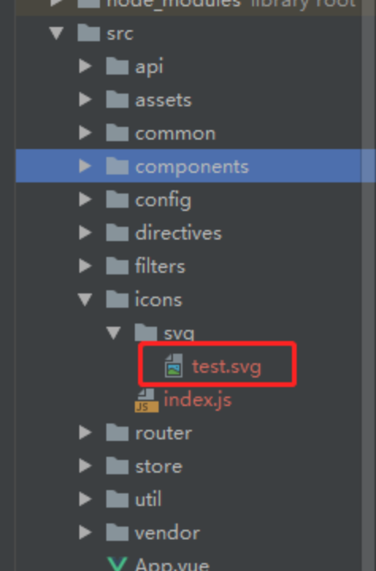

### 创建
```
vue init webpack mall-admin-web
```
### 清理项目不用的页面,清理route,main.js导入elementUI
```
import ElementUI from 'element-ui'
import 'element-ui/lib/theme-chalk/index.css';

Vue.use(ElementUI);
```
### 浏览器输入地址localhost:8080后自动跳转到login
```
const whiteList=['/login']
router.beforeEach((to,from,next)=>{
  if (whiteList.indexOf(to.path) !== -1) {
    next();
  } else {
    next('/login');
  }
});
```
### 创建login页
#### 项目集成svg,vue2与3不同,下面是2的
https://www.cnblogs.com/shenyf/p/10370949.html
1.安装依赖：
```
npm i svg-sprite-loader --save-dev
```
2.配置build文件夹中的webpack.base.conf.js，主要在两个地方添加代码，如下图所示
```
{
        test: /\.svg$/,
        loader: 'svg-sprite-loader',
        include: [resolve('src/icons')],
        options: {
          symbolId: 'icon-[name]'
        }
      },
      {
        test: /\.(png|jpe?g|gif|svg)(\?.*)?$/,
        loader: 'url-loader',
        exclude: resolve('src/icons'),
        options: {
          limit: 10000,
          name: utils.assetsPath('img/[name].[hash:7].[ext]')
        }
      },
```
3.在src/components下新建文件夹及文件SvgIcon/index.vue，index.vue中内容如下
```
<template>
  <svg :class="svgClass" aria-hidden="true" v-on="$listeners">
    <use :xlink:href="iconName"/>
  </svg>
</template>
 
<script>
  export default {
    name: 'SvgIcon',
    props: {
      iconClass: {
        type: String,
        required: true
      },
      className: {
        type: String,
        default: ''
      }
    },
    computed: {
      iconName() {
        return `#icon-${this.iconClass}`
      },
      svgClass() {
        if (this.className) {
          return 'svg-icon ' + this.className
        } else {
          return 'svg-icon'
        }
      }
    }
  }
</script>
 
<style scoped>
  .svg-icon {
    width: 1em;
    height: 1em;
    vertical-align: -0.15em;
    fill: currentColor;
    overflow: hidden;
  }
</style>
```
4.在src下新建icons文件夹，及icons文件夹下svg文件夹、index.js文件， index.js文件内容如下
```
import Vue from 'vue'
import SvgIcon from '@/components/SvgIcon'// svg组件
 
// register globally
Vue.component('svg-icon', SvgIcon)
 
const req = require.context('./svg', false, /\.svg$/)
const requireAll = requireContext => requireContext.keys().map(requireContext)
requireAll(req)
```
5.在main.js中引入svg
```
import './icons'
```
6.使用

1.下载svg图片，这里使用阿里云提供的iconfont：https://www.iconfont.cn/collections/index?spm=a313x.7781069.1998910419.4&type=1

2.点击图片，下载svg格式即可，将下载下来的图片放置到到项目中的svg文件夹下
<div>

</div>
3.在页面中使用
```
<svg-icon icon-class="test"></svg-icon>
```
### 安装normalize.css
```
npm i normalize.css --save-dev
```
```
import 'normalize.css/normalize.css'
```
### main.js引入自定义css
```
import './styles/index.scss'
```
### login.vue导入图片
```
  import login_center_bg from "../../assets/images/login_center_bg.png"

```
### 安装sass
```
npm install node-sass --save-dev 		//安装node-sass 
npm install sass-loader --save-dev 		//安装sass-loader 
npm install style-loader --save-dev 		//安装style-loader
```
报错后降级sass-loader,卸载当前版本 ,安装 
```
npm uninstall sass-loader
npm install sass-loader@7.3.1 --save-dev
```
### 自定义验证器
```
data() {
      //自定义验证
      const validateUsername=(rule,value,callback)=>{
        if (!isValidUsername(value)) {
          callback(new Error("请输入正确的用户名"));
        } else {
          callback();
        }
      }
      const validatePassword=(rule,value,callback)=>{
        if (value.length < 3) {
          callback(new Error("密码不能小于3位"));
        } else {
          callback();
        }
      }
      return {
        loginForm: {
          username: '',
          password: ''
        },
        loginRules: {
          //自定义验证器
          username: [{required: true, trigger: 'blur', validator: validateUsername}],
          password: [{required: true, trigger: 'blur', validator: validatePassword}]
        },
        loading:false,
        login_center_bg
      };

    },
//导入
import {isValidUsername} from "../../utils/validate";
//validate.js
export function isValidUsername(value) {
  return value.trim().length>=3
}

```
