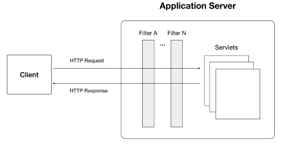
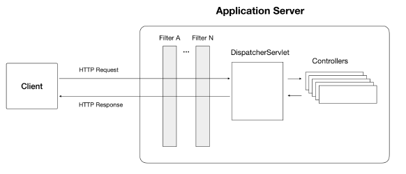

## 内容
- ioc and di
- spring mvc
- spring jdbc and jpa
- aop
- transaction
- spring boot
## IoC和DI
### 概念
- spring中java bean由spring容器管理
- java中管理对象依赖有两种方式
    - 对象本身通过构造器进行依赖管理，控制权在对象
    - 通过容器注入依赖bean（构造器注入，setters注入），这种方式对象本身不
 负责依赖对象的初始化，对象初始化由容器负责，控制权在容器，称为控制反转
- spring容器如何知道一个类依赖什么?通过使用配置元数据实现
- 配置中需要制定那些对象呗创建以及他们依赖什么
- 创建spring容器的方式
    - 传统方式：配置XML文件,applicationContext.xml
    - 从spring2.5使用基于注解的配置来提升容器
    - 从spring3.0使用基于java配置类来定义配置
### spring容器
Spring中，org.springframework.context.ApplicationContext接口代表Spring IoC容器，
通常使用ClassPathXmlApplicationContext 或者AnnotationConfigApplicationContext建立
spring容器，它们是ApplicationContext接口的实现，前者用于基于XML的配置，
后者是用于基于Java的配置
### 基于注解的配置
在少量bean需要初始化时，通过使用java配置类创建bean并合并他们到Spring容器
当由较多bean需要初始化，Spring提供了基于注解的配置来管理依赖关系，这需要两种
类型的注解，一个是声明bean，一个是装配此声明的bean作为依赖<br>
#### Bean的声明
Spring提供了一组用于声明的注解，@COmponent,@Service,@Controller,@Repository,当把这些注解用于
类后，Spring通过扫描用@ComponentScan注解描述的包后找到他们，如果在java配置类中同样配置了他们，java
配置类的优先
#### 依赖注入
声明bean过后，Spring使用@Required,@Autowired注解装配依赖bean，@Required注解对setter方法注释，
@Autowired注解对构造器，方法，字段注释，在Spring中，有三种方式进行依赖注入<br>
- 构造器注入
- Setter/method注入
- 字段注入
## Spring MVC
Spring mvc基于Java EE Servlet,用于创建web app,
### Jave EE Servlet原理
一个Java EE servlet位于一个Servlet容器中，这个容器通常是app server,比如Tomecat,
当客户端发送一个http请求到达服务器，先通过过滤器列表完成像认证，日志，授权等操作，如果请求正常通过过滤器，应用服务器会把它交给
已经注册的servlet，该servlet处理那些包含匹配特定URI模式的请求，Servlet完成请求处理，将返回一个http response,
这个响应经过相同的过滤器后返回给客户端<br>
<br>
在JavaEE中，每一个http请求都会创建一个HttpServletRequest实例，每个Http 响应同样创建一个HttpServletResponse实例，为了标识
用户的身份，应用服务器会在接受到第一次请求时创建HttpSession实例，每个httpsession实例有一个ID,sessionID,此session id会放在http
响应头中作为cookie发送给客户端，客户端将存储这个cookie,下一次请求时发送给服务端。这样，服务器通过HttpSession实例查找Session id能够识别
每个用户<br>
通过实现HttpSessionListener接口创建监听器监听HttpSession生命周期改变事件，或者实现ServletRequestListener接口监听生命周期请求<br>
如何创建servlet?实现javax.servlet.http.HttpServlet之后，或者用注解@WebService注释或者在web.xml文件中注册，另外还需要做URI到servlet的映射<br>
## DispatcherServlet
SpringMvc中，我们不需要创建servlets,为了完成一样的功能，Spring使用一个中心控制器DispatcherServlet接受请求，然后
根据请求的URI模式分发给不同的Controller处理请求<br>

### 控制器
创建一个类，用@Controller注释，用@RequestMapping注释URI模式。这个类称之为控制器类<br>
添加spring boot依赖
```
<parent>
<groupId>org.springframework.boot</groupId>
<artifactId>spring-boot-starter-parent</artifactId>
<version>2.0.0.RELEASE</version>
</parent>
<dependencies>
<dependency>
<groupId>org.springframework.boot</groupId>
<artifactId>spring-boot-starter-web</artifactId>
</dependency>
</dependencies>
```
```
@Controller
@RequestMapping("/messages")
public class MessageController {
@GetMapping("/welcome")
public String welcome() {
    return "Hello, Welcome to Spring Boot!";
    }
}
```
### 视图
在服务端通常返回一段html代码或者JSON data,这两种结果本质都是字符串对象。
然而把HTML代码混入JAVA中并不是一个好的编码方式，如果一定要使用html作为返回值，就需要使用模板引擎对混合的代码进行分离。如:thymeleaf,
```
<dependency>
<groupId>org.springframework.boot</groupId>
<artifactId>spring-boot-starter-thymeleaf</artifactId>
</dependency>
```
```
@GetMapping("/welcome")
public String welcome(Model model) {
model.addAttribute("message", "Hello, Welcome to Spring Boot!");
return "welcome";
}
```
### 过滤器
过滤器用于在请求到达servlet前对HTTP请求进行处理，它是责任链设计模式的实现。<br>
#### 创建
创建过滤器可以实现javax.servlet.Filter接口或者扩展org.springframework.web.filter.GenericFilterBean,spring提供的过滤器有一些好用的功能
```java
public class AuditingFilter extends GenericFilterBean {
@Override
public void doFilter(ServletRequest req, ServletResponse res,
FilterChain chain) throws IOException, ServletException {
long start = new Date().getTime();
chain.doFilter(req, res);
long elapsed = new Date().getTime() - start;
HttpServletRequest request = (HttpServletRequest) req;
logger.debug("Request[uri=" + request.getRequestURI() + ", method="
+
request.getMethod() + "] completed in " + elapsed + " ms");
}
}
```
#### 过滤器注册
过滤器创建后还需要注册，在spring boot应用中有两种方式，其一是在web.xml文件中<filter></filter>,其二是创建FilterRegistrationBean在配置类里注册，
web.xml用于war部署在应用服务器中，我们使用的是嵌入式服务器使用第二种方法<br>
步骤：先创建一个过滤器实例，使用setFilter()方法设置过滤器，使用setOrder()方法调整过滤器在链中的位置，使用setUrlPatterns()方法指定请求的url,
```java
public class AppConfig {
@Bean
public FilterRegistrationBean<AuditingFilter>
auditingFilterRegistrationBean() {
    FilterRegistrationBean<AuditingFilter> registration = new
    FilterRegistrationBean<>();
    AuditingFilter filter = new AuditingFilter();
    registration.setFilter(filter);
    registration.setOrder(Integer.MAX_VALUE);
    registration.setUrlPatterns(Arrays.asList("/messages/*"));
    return registration;
    }
}
```
## Spring JDBC 和JPA
- JDBC接口是访问关系型数据库的方式
- JDBC驱动是JDBC接口的实现，每种数据库对应各自的驱动
- Spring JDBC是JDBC接口之上的抽象层
- JPA定义了java对象持久化的方式，通过使用ORM机制建立对象模型和数据库中数据的桥梁。
- JDBC接口解决和数据库的交互，JPA以面向对象的方式解决对象模型到数据库的存储，检索，JPA
的实现依赖JDBC驱动
## Spring AOP
应用程序资源被访问时应该带有认证和授权，很多接口被访问时要带有安全检查，不可能在每个接口那里做安全
检查，因为导致了代码重复。这就需要在一个统一的地方执行安全检查，过滤器就是。但是过滤器安全检查只能在请求层面
执行，不能在方法级别检查，只有AOP能满足要求
### AOP概念
想要做什么事，比如日志，关注点就是要出日志的个各类，切面就是把处理个各类日志的逻辑放到一个类里面，连接点就是个各类里面要
出日志的方法，通知就是怎么出日志的方法，切入点就是切面中怎么才能匹配到要处理的类的方法<br>
- 关注点：concern,关注点跨越多个类，包括日志类型，事务类型等
- 切面：aspects,关注点代码在多个类存在，当把关注点逻辑放到一个面上不分散到多个类中就是切面
- 连接点：join point,需要被检查的方法
- 通知：Advice,切面类中的方法，处理关注的动作，包括不同类型：安全类型，日志日志等，通知有不同的执行方式
    - before advice:使用@Before注解，在连接点之前执行，除非抛出异常，否则不能阻止连接点执行
    - After returning advice:使用@AfterReturning注解，连接点正常执行后执行，不会引发异常
    - After throwing advice:使用@AfterThrowing注解，当方法抛出异常退出时执行
    - After advice:使用@After，通知的执行和连接点执行情况无关，像是try catch中的final block
    - Around advice:使用@Around,环绕通知，全方位控制
- 切入点：Pointcuts,用于匹配连接点，通过切入点表达式起作用,可以使用@Pointcut来声明一个切入点签名，声明的方法没有返回值，是个空方法
### 自定义注解
通常情况下使用切入点表达式匹配连接点，当需要指定方法时通过自定义注解的方式，只需要在方法上加上注解
## Spring事务管理
Spring事务提供了不同事务API的抽象，包括JTA(全局事务)、JDBC API\Hibernate事务API、JPA事务API,后面三种是本地事务<br>
- 全局事务可以使用多个事务源
- 本地事务使用特定的源，不能使用多个源
- Spring事务管理支持编程式和声明式事务管理
    - 编程式：使用Spring's TransactionTemplate API或者PlatformTransactionManager API
    - 声明式：基于AOP，使用@Transactional注解
- 无论编程式和声明式事务管理都支持回滚
### PlatformTransactionManager接口
对于不同的底层事务API，都有一个特定的实现，这些实现源于org.springframework.transaction.PlatformTransactionManager interface
对于Hibernate，PlatformTransactionManager的实现是HibernateTransactionManager,对于JDBC,实现是DataSourceTransactionManager...
```
public interface PlatformTransactionManager {
TransactionStatus getTransaction(TransactionDefinition definition) throws
TransactionException;
void commit(TransactionStatus status) throws TransactionException;
void rollback(TransactionStatus status) throws TransactionException;
}
```
## Spring boot
- 使用Spring Boot创建web应用是非常简单的，这种简单通过starters和自动化配置实现
- Spring boot应用通常继承自spring-boot-starter-parent项目，这个项目提供了maven的缺省值和依赖管理部分，使用中
不必指定依赖的版本，需要做的是是定spring boot的版本，当然也可以指定版本对spring boot的推荐进行覆盖
- Spring boot支持多种技术，要开始使用某种技术，只需要把这个技术对应的starter添加到依赖里，spring boot 会负责初始化需要的beans
### starters
- Spring Boot starters是依赖描述符的集合，只包含依赖描述文件pom.xml
- spring boot 有一个核心的starter,spring-bot-starter,所有其他的starters都依赖这个核心的starter，这个核心starter提供自动化配置的支持
- the core starter也是一个依赖描述文件，其自动化配置能力来源于spring-boot-autoconfigure依赖
### 自动化配置
- spring boot starters的自动化配置能力来源于spring-boot-autoconfigure
- @SpringBootApplication是自动化配置的触发器，它包含一组3个注解
    - @SpringBootConfiguration
    - @EnableAutoConfiguration
    - @ComponentScan
- 当使用@EnableAutoConfiguration时，spring-boot-autoconfigure将用类载入器载入元数据META-INF/spring.factories，所有的依赖都将被载入


