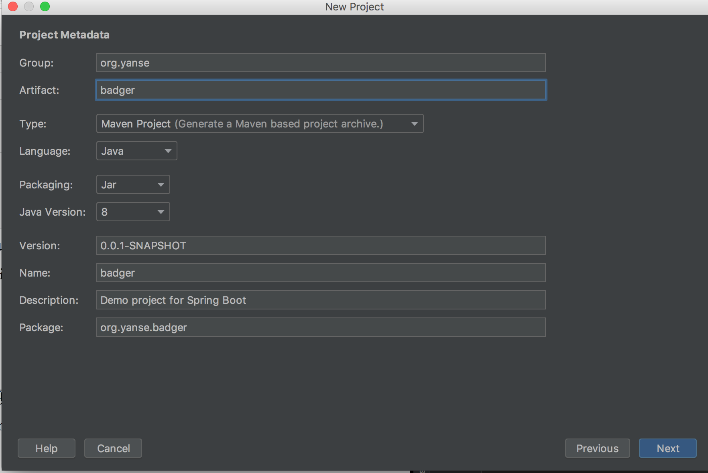
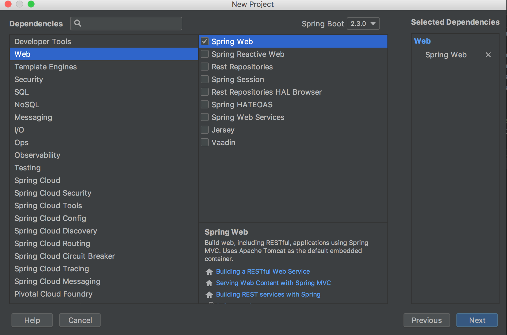
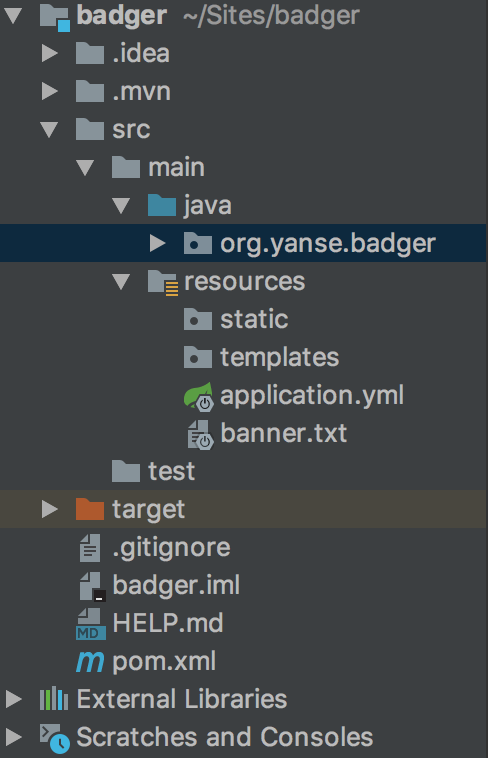

## 一.环境搭建
### 安装开发环境
1. jdk:1.8.0_131
2. 开发工具: idea
3. 数据库:MySQL5.7
4. 依赖工具:maven3.6.0
### 创建项目





### 项目测试
1. application.yml修改端口
```
server:
  port: 8081
```
2. org.yanse.badger包下创建controller/HelloController
```java
@RestController
public class HelloController {
    @GetMapping("/hello")
    public String hello() {
        return "hello";
    }
}
```
3. 运行项目测试


