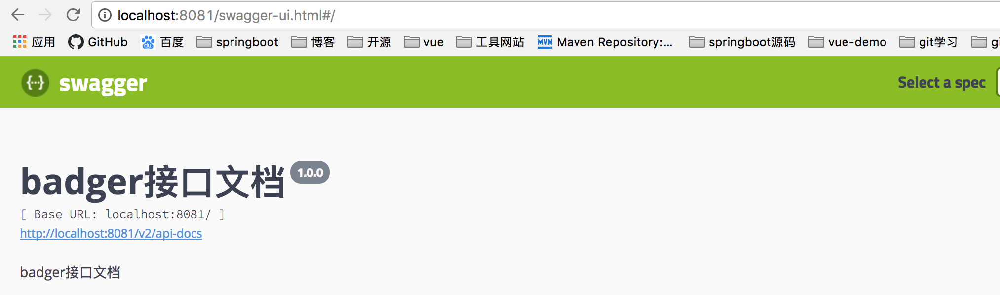
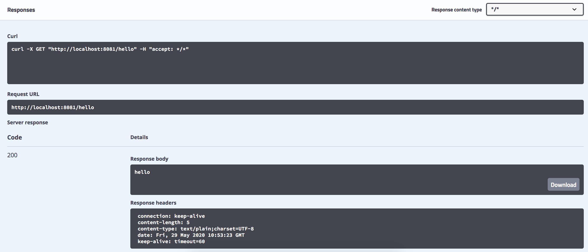

## 二.集成Swagger2文档
Swagger2 的出现就是为了从根本上解决上述问题。它作为一个规范和完整的框架，可以用于生成、描述、调用和可视化 RESTful 风格的 Web 服务：
- 接口文档在线自动生成，文档随接口变动实时更新，节省维护成本
- 支持在线接口测试，不依赖第三方工具
### 添加依赖
```xml
<dependencies>
    <!-- https://mvnrepository.com/artifact/io.springfox/springfox-swagger-ui -->
    <dependency>
        <groupId>io.springfox</groupId>
        <artifactId>springfox-swagger-ui</artifactId>
        <version>2.9.2</version>
    </dependency>
 <!-- https://mvnrepository.com/artifact/io.springfox/springfox-swagger2 -->
    <dependency>
       <groupId>io.springfox</groupId>
       <artifactId>springfox-swagger2</artifactId>
       <version>2.9.2</version>
    </dependency>
</dependencies>
```
### 配置Swagger2
org.yanse.badger下创建config/SwaggerConfig,
```java
@Configuration
@EnableSwagger2
public class SwaggerConfig {
    public static final String VERSION = "1.0.0";
    @Bean
    public Docket createRestApi() {
        return new Docket(DocumentationType.SWAGGER_2).apiInfo(apiInfo())
                .select()
                .apis(RequestHandlerSelectors.any())
                .paths(PathSelectors.any())
                .build();
    }

    private ApiInfo apiInfo() {
        return new ApiInfoBuilder()
                .title("badger接口文档") //设置文档的标题
                .description("badger接口文档") // 设置文档的描述
                .version(VERSION) // 设置文档的版本信息-> 1.0.0 Version information
                .build();
    }
}
```
### 页面测试
浏览器打开http://localhost:8081/swagger-ui.html#/

点击try it out

点击excute



