## vue
### 基础
vue是一套用于构建用户界面的前端框架
- vue特性
    - 数据驱动视图:vue会监听数据的变化，会自动重新渲染页面的结构
      
	- 双向数据绑定:填写表单，双向数据绑定可以辅助开发者在不操作DOM的前提下，自动把用户填写的内容同步到数据源
	  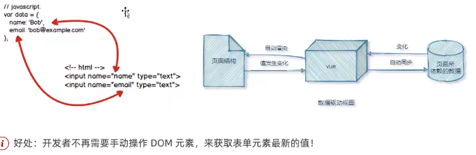
- 底层原理：MVVM是实现数据驱动视图和双向数据绑定的核心原理。
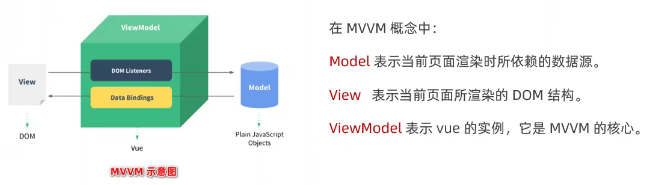
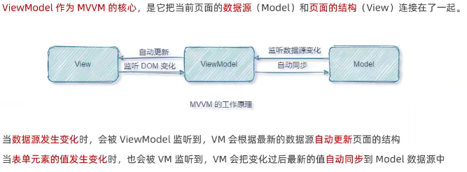
#### 基本使用
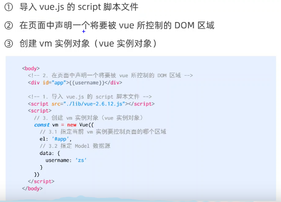
#### 调试工具
vuedevtools插件安装
#### 指令与过滤器
- 指令是vue提供的模板语法，辅助开发者渲染页面结构
	- 内容渲染：渲染文本内容
		- v-text:会覆盖元素内部原有内容
		  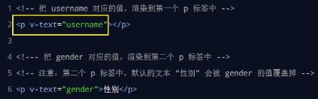
		- 插值表达式：{{}}，只是内容的占位符，不会覆盖原有字符
		  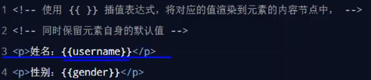
		- v-html：把带有标签的字符串渲染成真正的html内容
		  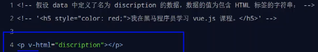
	- 属性绑定: 插值表达式只用用于内容节点不能用于属性节点
	 	- 如果要为元素绑定属性使用v-bind
		- v-bind可以简写为冒号 :
		- 属性绑定可以绑定表达式
		- 如果绑定的内容需要动态拼接，则字符串需要单引号
		`<div :title="'box'+index">这是一个div</div>`
	- 事件绑定
		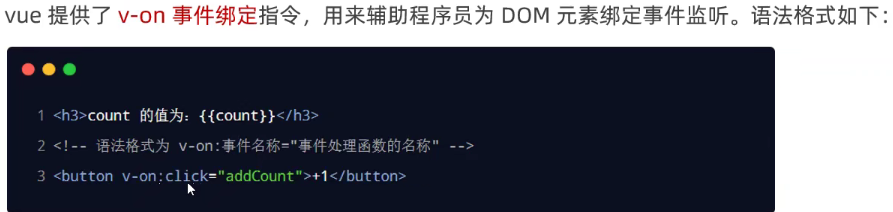
		- v-on简写成@
		- 原生DOM对象有onclick,oninput,onkeyup等事件，替换为vue事件绑定后，分别为：v-on:click,v-on:input,v-on:keyup
		- 如果绑定方法没有参数，默认传递事件对象e,如果传参，则vue提供了内置变量$event，它就是e，可以作为参数传递`<button v-on:click="addCount(1,$event)">加1</button>`
		- 事件修饰符：加在事件绑定后面`<a href="http://www.baidu.com" @click.prevent="show">跳转到百度</a>`
		  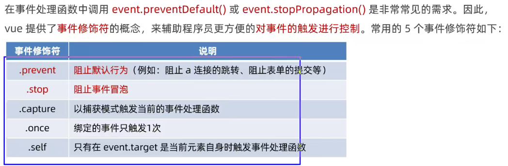
		- 事件冒泡：父子关系的dom中，元素同时绑定进行了事件监听，触发了子元素的事件后，父元素事件也会被触发，阻止外层事件的触发即为阻止事件冒泡
		```
		<div style="height:150px;background-color:orange;padding-left:100px;line-height:150px;" @click=divHandler>
            <button @click.stop='btnHandler'>阻止事件冒泡</button>
        </div>
    ```
        ```
        btnHandler(e){
                    //原生处理阻止冒泡
                    // e.stopPropagation()  
                    console.log('btnHandler')
                },
                divHandler(){
                    console.log('divHandler')
                }
        ```
		- 按键修饰符
		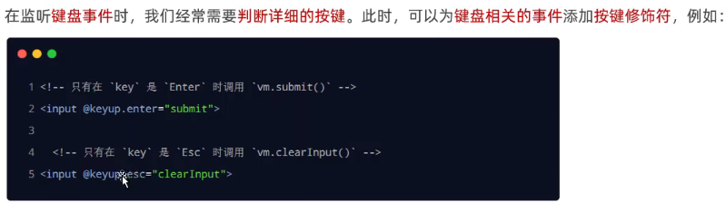
	- 双向绑定:
		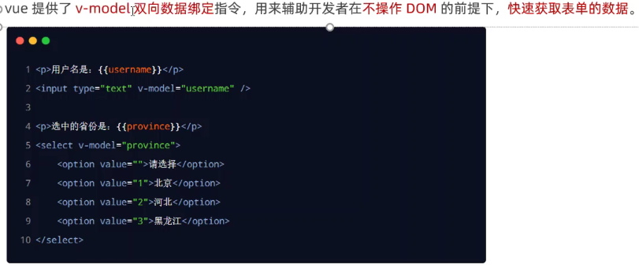
		- v-model是双向绑定,v-bind是单向绑定
		- v-model指令应用元素：input,textarea,select..
		- 指令修饰符
		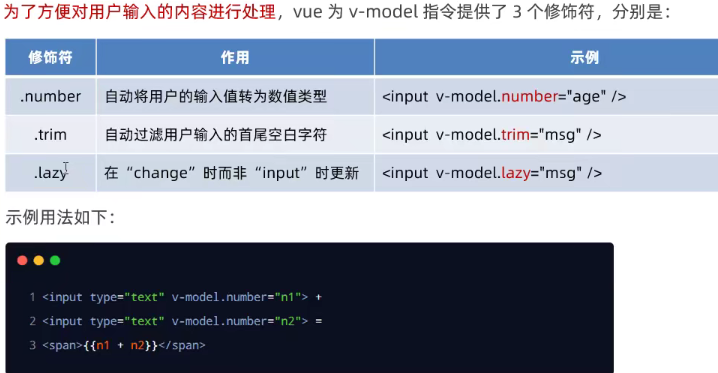
	- 条件渲染: v-if/v-show区别，v-if是对元素标签的控制v-show是对display的控制
	  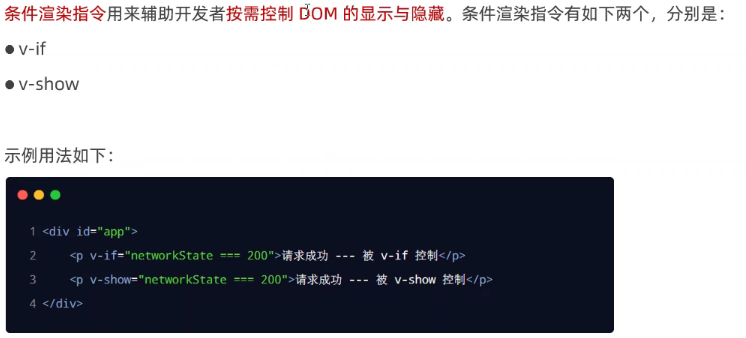
	  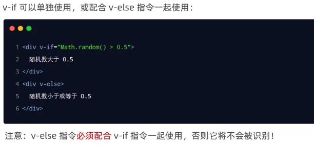
	  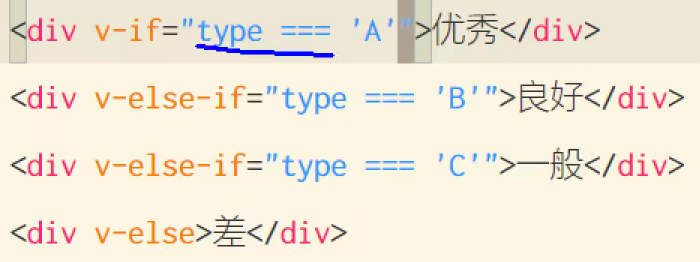
	- 列表渲染
		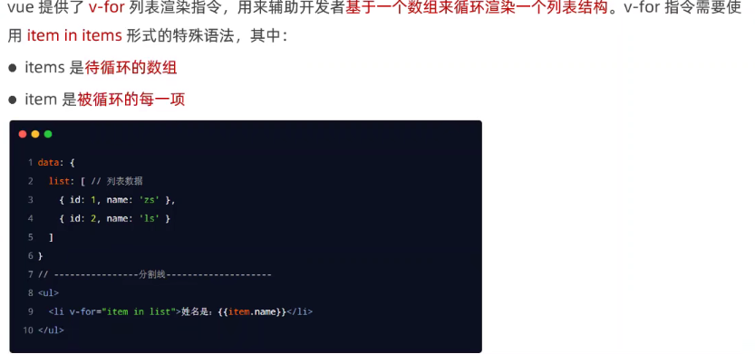
		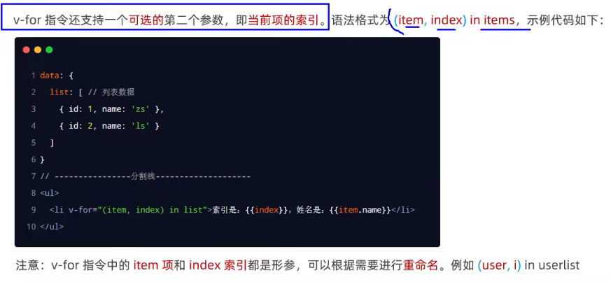
		- v-for指令使用：要绑定key属性,key的值只能是字符串或者数字，key值不能重复，建议使用循环id作为key,不能使用index索引做key值（可能重复）
		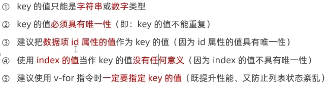
#### 案例
- label的for属性：for属性关联到id，点击label的文本内容会关联到选中元素