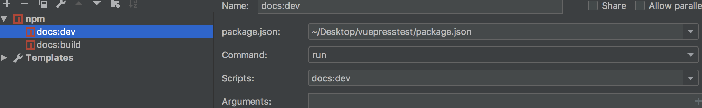

## 入门
>vuepress基础入门学习
### 基本操作
#### 1.初始化项目
```
npm init
```
#### 2.本地安装vuepress
```
npm install -D vuepress
```
#### 3.新建文件夹
```
mkdir docs
```
#### 4.新建一个 markdown 文件
```
echo '# Hello VuePress!' > docs/README.md
```
#### 5.开始写作
```
npx vuepress dev docs
```
> 如果你的现有项目依赖了 webpack 3.x,推荐使用 Yarn 而不是 npm 来安装 VuePress。因为在这种情形下，npm 会生成错误的依赖树。
#### 6.查看webpack版本
```
$ webpack-cli -version
3.3.11
$ webpack -version
4.43.0
```
#### 7.在package.json里加入脚本
```
{
  "scripts": {
    "docs:dev": "vuepress dev docs",
    "docs:build": "vuepress build docs"
  }
}
```
#### 8.开启
```
npm run docs:dev
```
#### 9.生成静态的 HTML 文件
默认情况下，文件将会被生成在 .vuepress/dist，当然，你也可以通过 .vuepress/config.js 中的 dest 字段来修改，生成的文件可以部署到任意的静态文件服务器上
```
npm run docs:build
```
#### 10.webstorm中编辑配置



