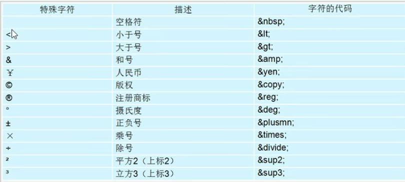

## 基础
### web标准
- 结构：对元素进行分类整理
- 样式：设置网页元素的板式、颜色、大小等外观
- 行为：网页模型的定义及交互
结构、样式、行为分离：具体表现为结构放到html,样式放到css,行为放到js
### html标签
##### 语法规范
1. 由尖括号包围
2. 双标签：有开始标签和结束标签：<></>
    - 包含关系
    ```
    <head>
        <title></title>
    </head>
    ```
    - 并列关系
    <head></head>
    <body></body>
3. 单标签：<br />
##### 基本结构标签

文件后缀名必须是html或者htm

```
    <html>
        <head>
            <title>标题</title>
        </head>
        <body>
        主体内容
        </body>
    </html>
```

##### 开发工具

- vscode

- webstorm

##### vscode快捷键： 
- 创建骨架： ！
  
##### vscode插件
- 中文： chinese
- 在浏览器中打开：open in browser
- 自动标签配对(前面修改了，后面标签自动修改)：auto rename tag
- 保存，自动格式化:js-css-html formatter
- 追踪到样式：css peek
##### 骨架标签简介
- `<!DOCTYPE html>`: 文档类型声明，表示h5

- `<html lang="en">`: 当前文档显示的语言

- `charset="UTF-8"`: 文档使用UTF-8进行编码
##### 常用标签
- 标题： `<h1></h1`  1-6 文字加粗，一行显示，依次变小

- 段落：`<p></p>` 把文字变成段落，段落之间有空隙

- 换行：`<br />` break的缩写

- 文本格式化标签：
	- 粗体`<strong></strong><b></b>`
  - 斜体`<em></em><i></i>`
  - 删除线`<del></del><s></s>`
  - 下划线`<ins></ins><u></u>`

- 布局标签
  - `<div> <span>`
  - div标签单独占一行
  - 一行可以有多个span
  
- 图形标签
	- ``
	- 行内标签
	
- 路径
	- 相对路径:以引用文件所在位置为参考的相对位置
		- 同一级 直接引用文件名src="img.img"
		- 上一级 src="../images/img.img"
		- 下一级 src="images/img.img"
	- 绝对路径:文件的绝对位置
	
- 超链接
	- 语法`<a href="跳转目标" target="弹出方式"></a>`
	- 连接分类
		- 外部链接 `<a href="http://www.qq.com">腾讯</a>`
		- 内部链接 网站内部页面链接,直接链接页面 `<a href="index.html">首页</a>`
		- 空链接 `<a href="#">空链接</a>`
		- 下载链接： 如果href地址是文件或者压缩包，会产生下载
		- 网页元素链接：不止文字可以做链接，图片图像表格音频视频等都可以做链接
		- 锚点链接：`<a href="#tow">锚点</a>  <h3 id="two">第二季</h3>`
	- target 
		- _self 当前窗口
		- _blank 新窗口
	
- html注释
	- 语法： <!-- 注释 -->
	
- 特殊字符
  