## 基础
### 浏览器执行js

浏览器分为两部分：

1. 渲染引擎：解析html,css,俗称内核
2. JS引擎：JS解释器，用来读取js代码并处理运行，如chrome的v8

###  js组成

1. ECMAScript规定了JS的语法和基础核心
2. DOM-文档对象模型：
3. BOM-浏览器对象模型

### js书写

1. 行内js
```
<!-- 行内式JS -->
    <input type="button" value="唐伯虎" onclick="alert('行内式JS')"> 
```
2. 内嵌式js
```
<script>
        alert("内嵌式JS")
    </script>
```
3. 外部JS文件引入
```
<script src="./js/alert.js">
```
4. js注释
//单行注释  ctrl+/
/*多行注释*/   shift+alt +a 
5. 输入输出
```
    <script>
        //输入框输出
        // prompt('输入框输出')
            //alt弹出警示框
        // alert('警示框')
            //
            // 控制台输出
        console.log('控制台输出')
    </script>
```
### js语法
##### 变量
1. 变量使用
	- 声明  `var age;`
	- 赋值  `age=19;`
	- 初始化：声明时直接赋值` var name='初始化'`
	- 重新赋值： `name='重新复制'`
2. 声明变量的特殊情况
	- 声明不赋值：类型undefined
	- 不声明不赋值：报错
	- 不声明直接赋值：可以使用不建议
	```
	    //只声明不赋值
        var sex;
        console.log(sex); //undefined
        //不声明不赋值
        //console.log(tel); //报错
        //不声明只赋值
        qq=110;
        console.log(qq) //110 可以使用
	```
3. 变量命名规范
	- 字母数字下划线美元符号组成
	- 严格区分大小写
	- 不能以数字开头
	- 不能是关键字保留字
	- 约定规范：驼峰法 
	
##### 数据类型

不同数据类型所占用的存储空间是不同的，变量的数据类型是不确定的，只有运行过程中根据等号右边的值确定的，并且变量的数据类型是可以转换的。

1. 分类
	- 简单数据类型
	- 复杂数据类型
2. 简单数据类型分类:5大类，Number,Boolean,String,Undefined,Null
	- 数字型：Number，整型，浮点型
		- 进制：
			- 八进制以0开头：`var num = 010;`
			- 十六进制以0x开头：` var num1 = 0x9;`
		- 范围：
			- Number.MAX_VALUE,Number.MIN_VALUE
		- 特殊值：
			- lnfinity无穷大
			- -lnfinity,无穷小
			- NaN,非数值
		- 方法
			- isNaN()是否数值
	- 字符串型:String,单引号或者双引号
		- 嵌套带引号的字符串：外双内单，或者外单内双防止引号就近匹配报错
		- 转义符
			- 以\开头,写到引号里面
			- \n换行 \\斜杠 \'  \" \t 缩进 \b空格
		- 字符串的长度str.length
		- 字符串的拼接，+  
		- 字符串和其他类型拼接结果是字符串类型，连接操作
		- 变量和字符串相连的口诀： 引引++，在字符串中先输入引号，再引号中写++，再++中写变量
	- 布尔型：Boolean,
	- undefined:已过变量声明未赋值就是undefined未定义数据类型
	- undefined和字符串相连结果是undefinedstr,和数值或者boolean相连结果是NaN
	- null空值：null和数值相加结果是数值，和字符串相连结果是nullstr,和布尔相连结果是1或者0
3. 获取变量类型
	- 数据类型检测 typeof :console.log(typeof num)
	- 字面量：数字字面量，字符串
	- 布尔字面量
	4.类型转换
	- 使用表单、prompt获取的数据默认是字符串类型
	- 变量类型转换
		- 转换为字符串
			- toString() `var num = 1;alert(num.toString())`
			- String()强制转换 `alert(String(num))`
			- 使用+号拼接结果是字符串 `alert(num + "我是字符串")`
		- 转换为数字
			- parseInt(string) 得到整数
			- parseFloat(string) 
			- Number('str')强制转换 
			- js隐式转换,使用算数运算符 `'12'- 0 `
		- 转换为布尔
			- Boolean(),空、否定的值会被转换为false,如'',0,NaN,null,undefined,其余都会转换为true
##### 运算符
- 算数运算符
	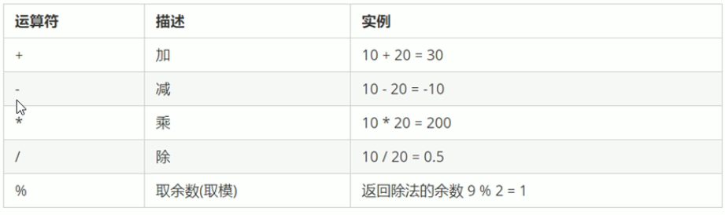
	- 浮点数运算问题，所以不能用浮点数作相等比较
	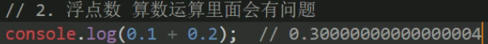
	- 算数运算符优先级问题
	- 表达式：数字运算符变量组成的式子，等号右边
- 递增和递减运算符
	两类运算符单独使用效果一样，和其他代码连用不一样
	- 前置递增递减运算符 ：先加一，再返回原值
	- 后置递增递减运算符：先返回原值再加一
	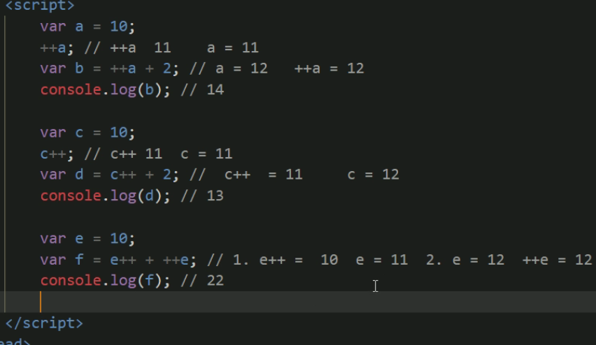
	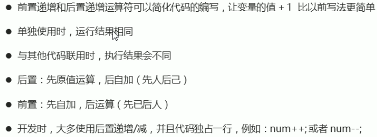
- 比较运算符
	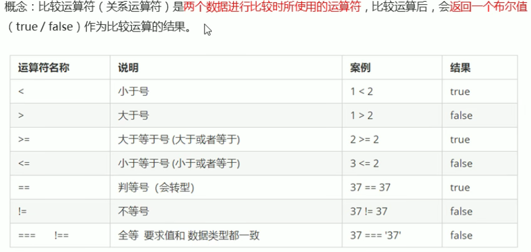
	- '=='默认转换数据类型，字符串转换为数字型
	- '==='要求两侧的值和数据类型完全一致
	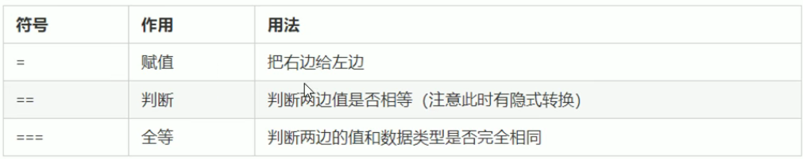
- 逻辑运算符
	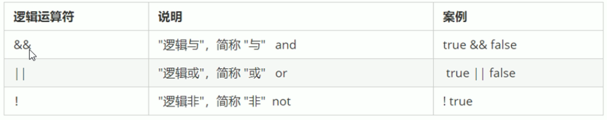
	- 短路运算：当有多个表达式时，左边的表达式确定结果后，后面就不进行运算了 
- 赋值运算符
	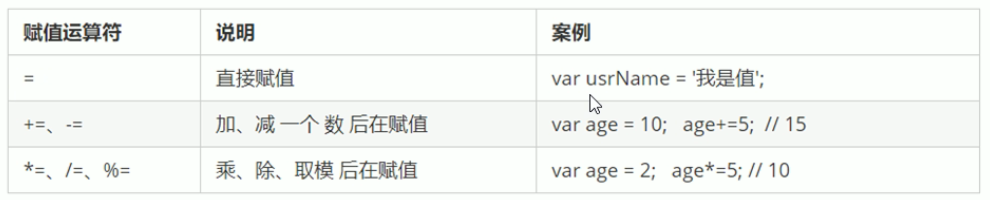
- 运算符优先级
	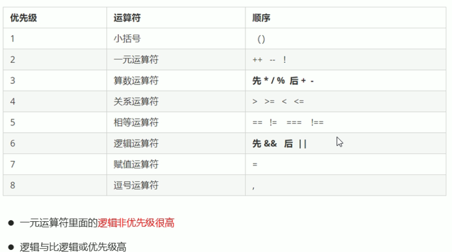
##### 流程控制
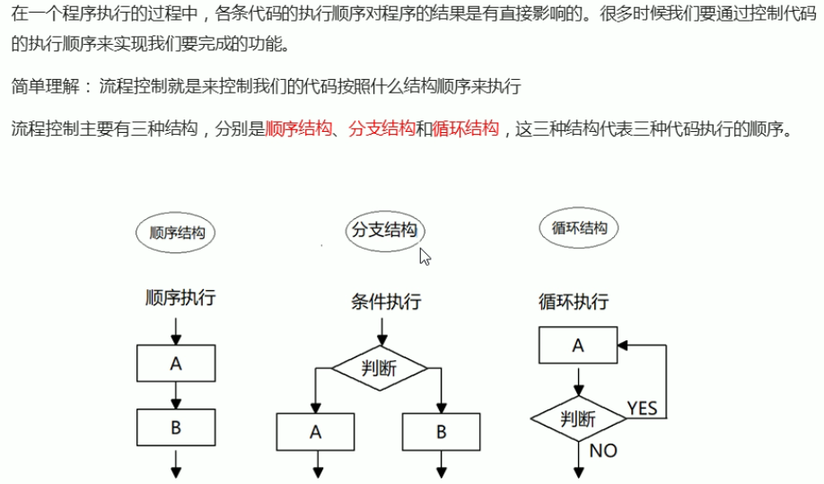
- 顺序结构

- 分支结构
	- if else
	- 三元表达式：由三元运算符组成的表达式
	- switch:表达式的值和case的value匹配，都匹配不上执行defalut,匹配上不执行default 
		- 表达式的值和value匹配是===的关系
		- 如果不在每个分支写break;,匹配后不会退出继续向下执行
		- if...else多用于判断范围
	```
	switch(表达式){
		case value1:
			//执行语句
			break;
		case value2:
			//执行语句
			break;
		default:
			//执行最后的语句
	}
	```
	
- 循环结构
	重复执行的语句被称为循环体，能否继续执行取决于终止条件
	
	- for循环
	  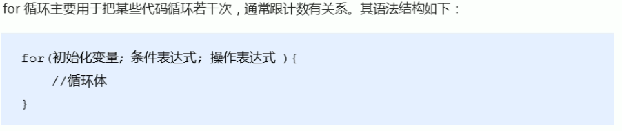
	
	- 双重for循环
	  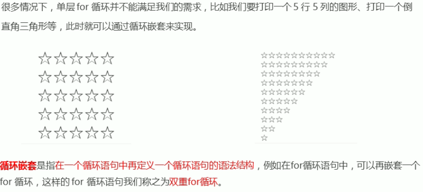
	
	- while循环
	  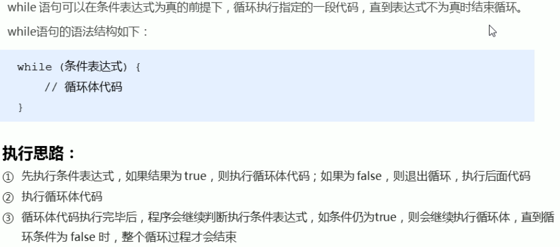
	
	- do while循环:先执行循环体
	
	  ```
	  do {
	  	//循环体
	  }while(条件表达式)
	  ```
	
	- continue break
	  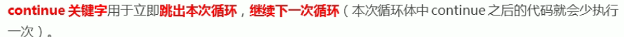
	  ```
	  <script>
    //1-100，除了能被7整除之外的整数和
      var sum = 0;
      for (let index = 0; index <= 100; index++) {
          if(index%7 == 0){
              continue;
          }
          sum +=i;
      }
      console.log(sum);
    </script>
	  ```
	  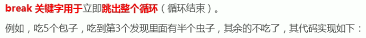
	  ```
	  for(var i=1;i<=5;i++){
        if(i==3){
            break;
        }
        console.log('吃第'+i+'个')
      }
	  ```
	- 断点调试
	
	  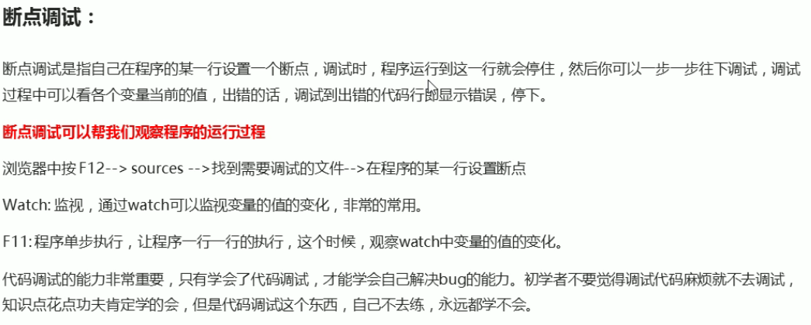
##### 标识符命名、操作符规范
- 变量、函数命名要有意义
- 变量用名词
- 函数用动词
- 操作符两侧要有空格
##### 数组
- 数组简述:把一组相关的数据一起存放，并提供方便的访问方式
  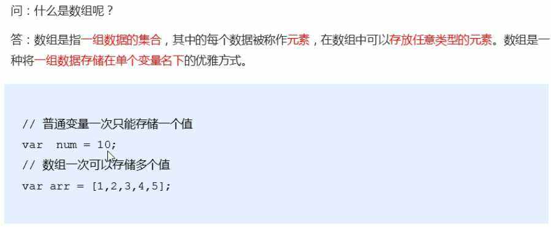

- 创建数组

   - 利用new创建数组 var arr=new Array() //新的空数组
   - 利用数组字面量创建数组
     	-  var arr=['aa','bb','cc']
     	-  var arr = []  //创建空数组

- 获取数组元素

  - 数组的索引：用来访问数组元素的序号，下标从0开始
  - 数组通过索引号访问数组元素  数组名[索引号]

- 数组遍历:通过循环取出数组元素
  ```
  var arr1 = ['1','ab','c'];
  for(var i=0;i<arr1.length;i++){
     console.log(arr1[i]);
  }
  ```
	- 数组的长度： 数组名.length
	- console.log输出多个变量用逗号分隔，console.log(a,b,c)
	- 求数组中最大值
	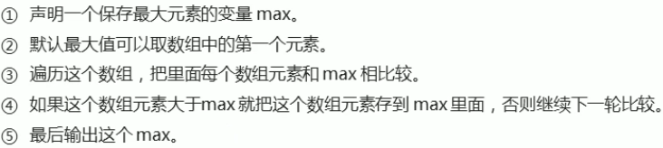
	```
	 var max=arr3[0];
      for(var i=0;i<arr3.length;i++){
        if(arr3[i]>max){
          max=arr3[i];
        }
      }
      console.log(max);
	```
	- 数组转换字符串
	```
	var arr4 = ['red','green','blue','pink'];
      var str='';
      var sep = '!'
      for (let index = 0; index < array.length; index++) {
         str += arr4[index] +sep;
      }
	```
- 数组新增、修改元素
	- 给数组名赋值情况：原来元素会被替换
	- 通过修改length长度
	```
	//修改length长度
     var arr = ['red','green','blue']
     arr.length =5;
     arr[3]='black';
     arr[4]='white';
      console.log(arr);
	```
	- 通过修改索引号追加元素：不必修改数组长度，直接使用下标添加，承接上面例子
	```
	arr[5]='pink'
	```
	- 案例
	```
	<script>
     //在数组中找出大于10的元素组成新数组
     var arr = [2,0,6,1,77,0,52,0,25,7];
     var newArr = [];
     var j = 0;
     for(var i = 0;i<arr.length;i++){
       if(arr[i]>10){
         newArr[j]=arr[i];
         j++;
       }
     }
    </script>
    <script>
     //在数组中找出大于10的元素组成新数组
     var arr = [2,0,6,1,77,0,52,0,25,7];
     var newArr = [];
     for(var i = 0;i<arr.length;i++){
       if(arr[i]>10){
         newArr[newArr.length]=arr[i];
         j++;
       }
     }
    </script>
    //翻转数组
    <script>
     //数组翻转
     var arr = ['red','green','blue','pink','purple']
     var newArr = [];
     for(var i =arr.length-1;i>=0;i--){
       newArr[newArr.length]=arr[i]
     }
    </script>
	```

- 冒泡排序
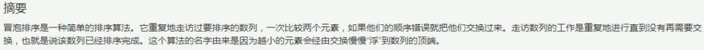
##### 函数
- 概念：封装可以被重复调用的代码块，目的：复用
- 使用:函数本身只是代码块，只有被调用使用
	- 声明
	```
	fucntion 函数名(){
		函数体
	}
	```
	- 调用
	```
		函数名()
	```
- 参数：利用函数的参数复用同样的函数
```
fucntion 函数名(形参1，形参2，...){
	函数体
}
```
	- 形参、实参：函数声明里是形参，调用里是实参
	- 参数的作用：条件不固定时，使用参数复用函数
	- 形参和实参个数不匹配的问题：
		- 如果个数一致，正常结果
		- 如果实参个数多于形参，多的实参不发生作用
		- 如果实参个数少于形参，则形参的值定义为undefined
	- 小结
		- 函数可以带参数也可以不带
		- 声明函数的时候，形参的默认值是undefined
		- 调用函数的时候，参数是实参
		- 多个参数使用逗号分隔
		- 形参的个数可以和实参的个数不匹配，但结果不可预计
- 返回值：
> return的结果返回给函数调用者,return只能返回一个值，如果用逗号隔开多个值，以最后一个为准,想返回多个值可以返回数组
> 函数如果有return返回return后面的值，没有return，返回undefined
> return在循环中使用，不仅退出循环，还能返回值，溶蚀结束当前代码
```
	function 函数名（）{
		return 返回值
	}
```
```
   <script>
      //利用函数求数组[5,2,44,62,102]的最大值
     function getMax(arr){
       var max=arr[0];
       for(var i=1;i<=arr.length;i++){
         if(arr[i]>max){
           max=arr[i];
         }
       }
       return max
     }
     var arr = [5,2,44,62,102];
     console.log(getMax(arr));
    </script>
```
- arguments的使用
	当不确定函数有多少个参数传递时，可以使用arguments来获取参数，arguments是当前函数的内置对象，存储了传递的所有实参
	- arguments展示形式是一个伪数组，具有以下特点
		- 可以遍历
		- 具有length
		- 按索引方式存储数据
		- 不具有数组的push,pop方法
		
- 案例
- 两种声明方式
	- 使用关键字function自定义函数（命名函数）
	- 函数表达式（匿名函数）
	> 函数表达式声明方式和声明变量差不多，变量存的是值，函数表达式存的是函数
	> 函数表达式可以传递参数
	```
	var 变量名 = function(){
		//函数体
	}
	```
##### 作用域
> 代码在某个范围是否起作用，目的提高程序可靠性和命名冲突
- 作用域(es5)
	- 全局作用域
		- script标签内
		- 单独的js文件
	- 局部作用域
		- 函数内部
- 变量的作用域
	- 全局变量：全局作用域下的变量，全局下都可以使用
		- 如果在函数内部没有声明，直接赋值，也属于全局变量
		- 全局变量只有浏览器关闭才会销毁
	- 局部变量：局部作用域下或者函数内部用var声明的变量，只能在函数内部使用
		- 函数的形参也是局部变量
		- 代码块执行完毕销毁
- es6块级作用域：
	
	> {}内，外部不能使用，es5没有块级作用域，如if(){}，在{}内声明的变量外部可以使用
- 作用域链
> 函数内还有函数的情况，内部函数可以访问外部函数的变量，链式查找采用就近原则
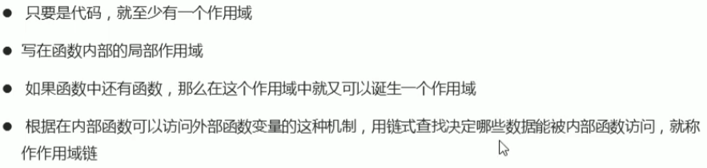
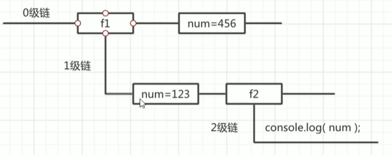
##### js预解析（运行机制）
js在浏览器引擎里运行，先进行预解析，再执行
- 预解析
js引擎会把js里面所有的var，还有functions声明提升到当前作用域的最前面，然后按代码书写顺序从上往下执行
- 变量和函数的预解析
	- 变量提升：把所有变量声明提升到当前作用域的最前面，函数内部也进行提升，不提升赋值
	- 函数提升：把所有函数声明提升到当前作用域前面，函数内部也进行提升，不提升调用
- 案例
> 特别注意：函数内var a=b=c=9;,相当于var a=9;b=9;c=9 也就是说b,c 前面没有var 属于全局变量
##### js对象
- 对象
js中，对象是无序的相关属性和方法的集合，由属性和方法组成
> 为什么需要对象：保存一个值用变量，多个值用数组，一个人的完整信息用对象保存，
- 创建对象三种方式
> 变量和属性的区别：都是用来存储数据，变量需要单独声明，使用直接写变量名，单独存在，属性在对象里不需要声明，使用对象名.属性名
> 函数和方法：都是用来实现功能，函数单独声明 ,调用函数名()，单独存在，方法 在对象里面调用：对象.方法()
	- 利用对象字面量创建对象{}
	```
	<script>
     //创建空对象
     var obj={}
     //创建对象
     //1.属性或方法采用键值对形式
     //2.多个属性或者方法用逗号隔开
     //3.方法名后面跟一个匿名函数
     var person = {
       name:'张三丰',
       age:18,
       sex:'男',
       sayHi:function(){
         console.log('hi~~~');
       }
     }
     //对象使用
     //1.调用属性：对象名.属性名
     //2.调用属性: 对象名['属性名']
     //3.调用方法： 对象名.方法名()
     console.log(obj.name);
     console.log(obj['name']);
     console.log(obj.sayHi());
    </script>
	```
	- 利用new Object创建对象
	```
	<script>
     //利用new Object创建对象
     var obj=new Object(); //创建空对象
     obj.name='张三丰';
     obj.age=18;
     obj.sex='男';
     obj.sayHi = function(){
      console.log('hi~~~');
     }
    //调用
    console.log(obj.name); 
    console.log(obj['sex']);
    obj.sayHi();
    </script>
	```
	- 利用构造函数创建对象
	> 前面两种方式一次只能创建一个对象，如果需要创建多个对象，里面很多属性和方法相同，因此可以利用函数复用相同的代码，这个函数就是构造函数，但是这个函数封装的不是普通代码而是对象，所以构造函数就是把对象里面相同的属性和方法抽象出来封装到函数里
	> 构造函数是一种特殊的函数，用来初始化对象，总是与new连用
	```
	<script>
        //利用构造函数创建对象
        //语法
        //1.函数名首字母大写
        //2.不需要返回值
        //3.调用构造函数返回的是一个对象
        //4.调用构造函数必须使用new
        //5.属性或者方法名前必须加this
        //6.构造函数像类
        function 构造函数名(){
            this.属性=值;
            this.方法=function(){
            }
        }
        new 构造函数名();

        function Star(name,age,sex){
            this.name=name;
            this.age=age;
            this.sex=sex;
            this.sing=function(){
                console.log('sing')
            }
        }
        var ldh= new Star('刘德华',18,'男')
        var zxy = new Star('张学友',19,'男')
       </script>
    ```
- new关键字
> 使用new创建对象的过程称为对象实例化
	1. new构造函数在内存中创建一个空对象
	2. 让this指向刚创建的空对象
	3. 执行构造函数的代码，给空对象添加属性和方法
	4. 返回对象
- 遍历对象属性
	- 使用for in遍历对象
	```
	//遍历对象
     for (const key in object) {
       if (Object.hasOwnProperty.call(object, key)) {
       	console.log(key);  //属性名，方法名
         const element = object[key];  //属性值，方法
         
       }
     }
	```